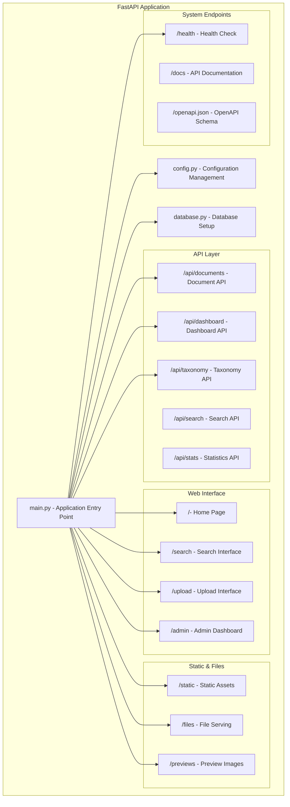
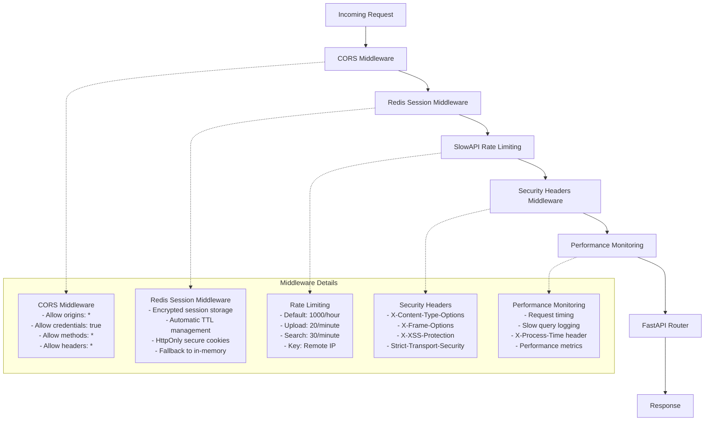
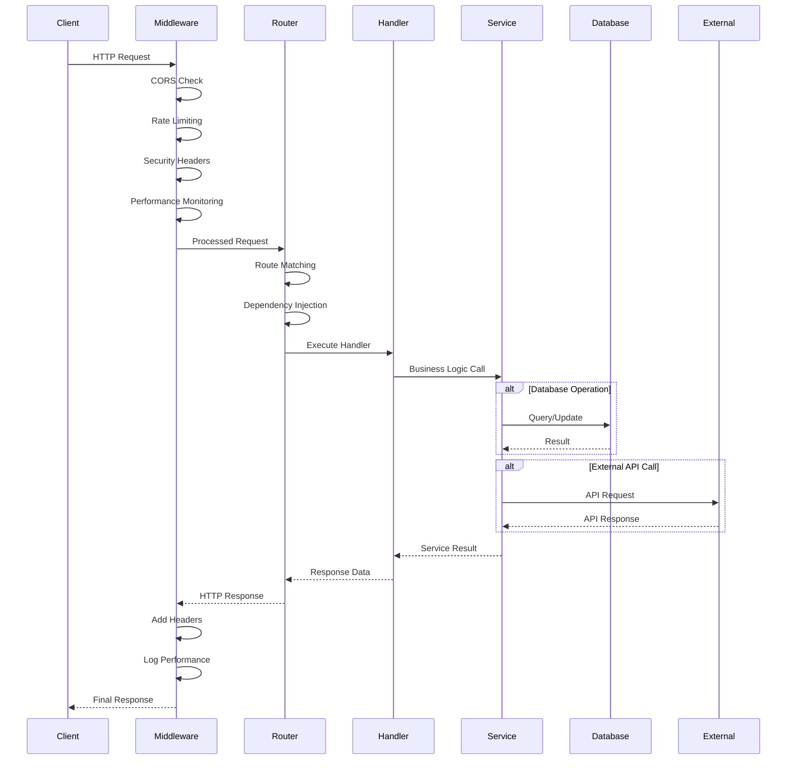
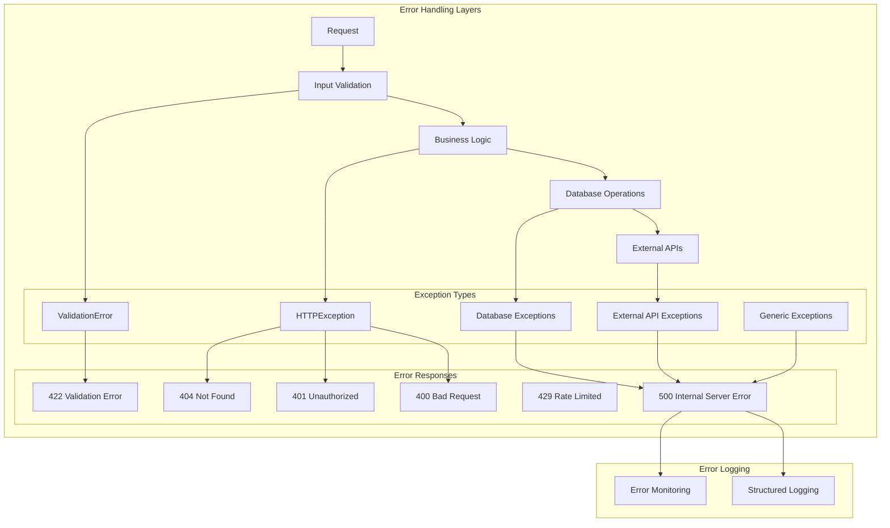
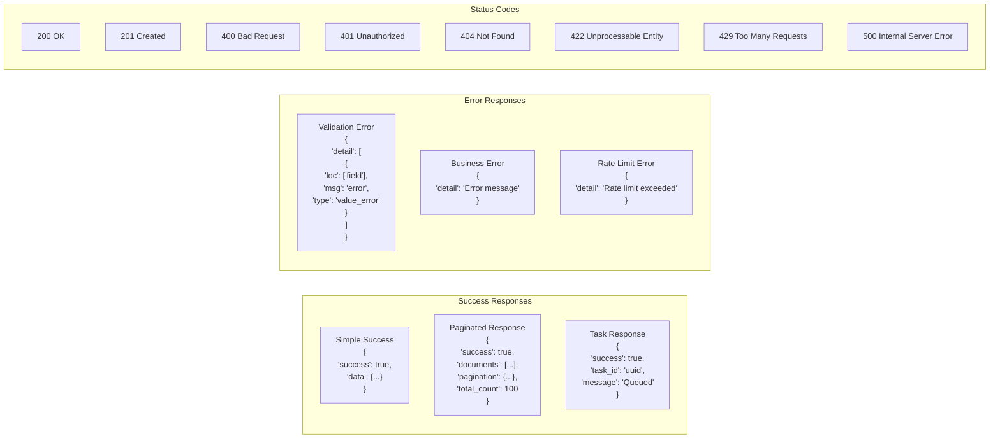
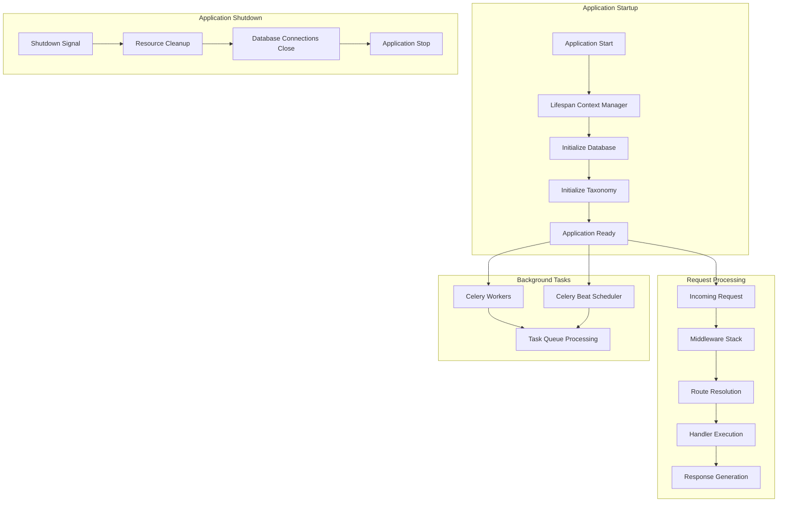

# Application Layer Architecture

## Document Catalog - FastAPI Application Structure

This document details the application layer architecture, focusing on the FastAPI application structure, API design patterns, middleware stack, and routing organization.

## FastAPI Application Structure



## Middleware Stack



## API Router Organization

```mermaid
graph LR
    subgraph "Main Application (main.py)"
        MAIN_APP[FastAPI App Instance]
        MAIN_ROUTES[Direct Routes in main.py]
    end

    subgraph "API Routers"
        DOC_ROUTER[documents.py Router]
        DASH_ROUTER[dashboard.py Router]
        TAX_ROUTER[taxonomy.py Router]
    end

    subgraph "Route Categories"
        subgraph "Document Routes"
            DOC_UPLOAD[POST /api/documents/upload]
            DOC_SEARCH[GET /api/documents/search]
            DOC_GET[GET /api/documents/{id}]
            DOC_DOWNLOAD[GET /api/documents/{id}/download]
            DOC_PREVIEW[GET /api/documents/{id}/preview]
            DOC_STATUS[GET /api/documents/{id}/status]
            DOC_REPROCESS[POST /api/documents/{id}/reprocess]
            DOC_ANALYZE[POST /api/documents/{id}/analyze]
            DOC_MAPPINGS[GET /api/documents/{id}/mappings]
        end

        subgraph "Dashboard Routes"
            DASH_DATA[GET /api/dashboard/data]
            DASH_METRICS[GET /api/dashboard/metrics]
            DASH_QUEUE[GET /api/dashboard/queue-health]
        end

        subgraph "Taxonomy Routes"
            TAX_CATEGORIES[GET /api/taxonomy/categories]
            TAX_SUBCATEGORIES[GET /api/taxonomy/categories/{cat}/subcategories]
            TAX_HIERARCHY[GET /api/taxonomy/hierarchy]
            TAX_FILTER[GET /api/taxonomy/filter-data]
            TAX_CANONICAL[GET /api/taxonomy/canonical-terms]
            TAX_SEARCH[GET /api/taxonomy/search]
            TAX_STATS[GET /api/taxonomy/stats]
        end

        subgraph "Main App Routes"
            MAIN_HOME[GET / - Home]
            MAIN_SEARCH_PAGE[GET /search - Search Page]
            MAIN_UPLOAD_PAGE[GET /upload - Upload Page]
            MAIN_ADMIN_PAGE[GET /admin/dashboard - Admin]
            MAIN_HEALTH[GET /health - Health Check]
            MAIN_STATS[GET /api/stats - Statistics]
            MAIN_AI_INFO[GET /api/ai/info - AI Info]
            MAIN_TASK_STATUS[GET /api/tasks/{id}/status]
            MAIN_TOP_QUERIES[GET /api/search/top-queries]
            MAIN_CANONICAL_SEARCH[GET /api/search/canonical/{term}]
            MAIN_VERBATIM_SEARCH[GET /api/search/verbatim/{term}]
            MAIN_MAPPING_STATS[GET /api/stats/mappings]
        end
    end

    MAIN_APP --> DOC_ROUTER
    MAIN_APP --> DASH_ROUTER
    MAIN_APP --> TAX_ROUTER
    MAIN_APP --> MAIN_ROUTES

    DOC_ROUTER --> DOC_UPLOAD
    DOC_ROUTER --> DOC_SEARCH
    DOC_ROUTER --> DOC_GET
    DOC_ROUTER --> DOC_DOWNLOAD
    DOC_ROUTER --> DOC_PREVIEW
    DOC_ROUTER --> DOC_STATUS
    DOC_ROUTER --> DOC_REPROCESS
    DOC_ROUTER --> DOC_ANALYZE
    DOC_ROUTER --> DOC_MAPPINGS

    DASH_ROUTER --> DASH_DATA
    DASH_ROUTER --> DASH_METRICS
    DASH_ROUTER --> DASH_QUEUE

    TAX_ROUTER --> TAX_CATEGORIES
    TAX_ROUTER --> TAX_SUBCATEGORIES
    TAX_ROUTER --> TAX_HIERARCHY
    TAX_ROUTER --> TAX_FILTER
    TAX_ROUTER --> TAX_CANONICAL
    TAX_ROUTER --> TAX_SEARCH
    TAX_ROUTER --> TAX_STATS

    MAIN_ROUTES --> MAIN_HOME
    MAIN_ROUTES --> MAIN_SEARCH_PAGE
    MAIN_ROUTES --> MAIN_UPLOAD_PAGE
    MAIN_ROUTES --> MAIN_ADMIN_PAGE
    MAIN_ROUTES --> MAIN_HEALTH
    MAIN_ROUTES --> MAIN_STATS
    MAIN_ROUTES --> MAIN_AI_INFO
    MAIN_ROUTES --> MAIN_TASK_STATUS
    MAIN_ROUTES --> MAIN_TOP_QUERIES
    MAIN_ROUTES --> MAIN_CANONICAL_SEARCH
    MAIN_ROUTES --> MAIN_VERBATIM_SEARCH
    MAIN_ROUTES --> MAIN_MAPPING_STATS
```

## Dependency Injection Pattern

```mermaid
graph TD
    subgraph "FastAPI Dependency System"
        REQUEST[HTTP Request] --> DEPS[Dependency Resolution]

        subgraph "Database Dependencies"
            GET_DB[get_db() -> Session]
        end

        subgraph "Service Dependencies"
            GET_DOC_SVC[get_document_service() -> DocumentService]
            GET_AI_SVC[get_ai_service() -> AIService]
            GET_SEARCH_SVC[get_search_service() -> SearchService]
            GET_STORAGE_SVC[get_storage_service() -> StorageService]
            GET_TAXONOMY_SVC[get_taxonomy_service() -> TaxonomyService]
            GET_PREVIEW_SVC[get_preview_service() -> PreviewService]
        end

        subgraph "Endpoint Handler"
            HANDLER[Route Handler Function]
        end
    end

    DEPS --> GET_DB
    GET_DB --> GET_DOC_SVC
    GET_DB --> GET_AI_SVC
    GET_DB --> GET_SEARCH_SVC
    GET_STORAGE_SVC --> GET_PREVIEW_SVC
    GET_PREVIEW_SVC --> GET_SEARCH_SVC

    GET_DOC_SVC --> HANDLER
    GET_AI_SVC --> HANDLER
    GET_SEARCH_SVC --> HANDLER
    GET_STORAGE_SVC --> HANDLER
    GET_TAXONOMY_SVC --> HANDLER
    GET_PREVIEW_SVC --> HANDLER

    HANDLER --> RESPONSE[HTTP Response]
```

## Request/Response Flow



## Error Handling Architecture



## API Response Patterns



## Configuration Management

```mermaid
graph TD
    subgraph "Configuration Hierarchy"
        ENV_FILE[.env File]
        ENV_VARS[Environment Variables]
        DEFAULTS[Default Values]

        subgraph "Settings Classes"
            BASE_SETTINGS[Settings - Base Class]
            DEV_SETTINGS[DevelopmentSettings]
            PROD_SETTINGS[ProductionSettings]
            RENDER_SETTINGS[RenderSettings]
        end

        subgraph "Configuration Categories"
            APP_CONFIG[App Configuration]
            DB_CONFIG[Database Configuration]
            AI_CONFIG[AI Service Configuration]
            STORAGE_CONFIG[Storage Configuration]
            SECURITY_CONFIG[Security Configuration]
        end
    end

    ENV_VARS --> BASE_SETTINGS
    ENV_FILE --> BASE_SETTINGS
    DEFAULTS --> BASE_SETTINGS

    BASE_SETTINGS --> DEV_SETTINGS
    BASE_SETTINGS --> PROD_SETTINGS
    PROD_SETTINGS --> RENDER_SETTINGS

    BASE_SETTINGS --> APP_CONFIG
    BASE_SETTINGS --> DB_CONFIG
    BASE_SETTINGS --> AI_CONFIG
    BASE_SETTINGS --> STORAGE_CONFIG
    BASE_SETTINGS --> SECURITY_CONFIG

    subgraph "Runtime Selection"
        ENVIRONMENT[ENVIRONMENT Variable]
        GET_SETTINGS[get_settings() Function]
        CACHED_SETTINGS[@lru_cache Decorator]
    end

    ENVIRONMENT --> GET_SETTINGS
    GET_SETTINGS --> CACHED_SETTINGS
    CACHED_SETTINGS --> DEV_SETTINGS
    CACHED_SETTINGS --> PROD_SETTINGS
    CACHED_SETTINGS --> RENDER_SETTINGS
```

## Application Lifecycle



## Key Application Patterns

### **Dependency Injection**

- FastAPI's built-in dependency system
- Service layer instantiation through dependencies
- Database session management per request
- Automatic cleanup and resource management

### **Session Management Pattern**

- Redis-backed session storage for scalability
- Encrypted session data for security
- Automatic session lifecycle management
- Graceful fallback when Redis unavailable

### **Async/Await Pattern**

- Asynchronous request handlers for I/O operations
- Non-blocking database queries
- Concurrent external API calls
- Background task integration

### **Service Layer Pattern**

- Business logic separated from API handlers
- Reusable service classes with clear interfaces
- Dependency injection for service instantiation
- Testable and maintainable code structure

### **Configuration Management**

- Environment-based configuration selection
- Pydantic settings for validation and type safety
- Cached configuration loading
- Hierarchical settings inheritance

### **Error Handling Strategy**

- Centralized exception handling
- Structured error responses
- Comprehensive logging
- User-friendly error messages

### **API Design Principles**

- RESTful resource-based URLs
- Consistent response formats
- Proper HTTP status codes
- Comprehensive API documentation

## Performance Considerations

### **Request Optimization**

- Async handlers for non-blocking operations
- Database connection pooling
- Query optimization and indexing
- Response caching strategies

### **Middleware Efficiency**

- Minimal middleware overhead
- Efficient rate limiting implementation
- Optimized security header injection
- Performance monitoring without impact

### **Resource Management**

- Automatic database session cleanup
- Memory-efficient file handling
- Connection pool management
- Background task resource isolation

This application architecture provides a solid foundation for the Document Catalog system, ensuring scalability, maintainability, and performance while following FastAPI best practices and modern Python development patterns.
