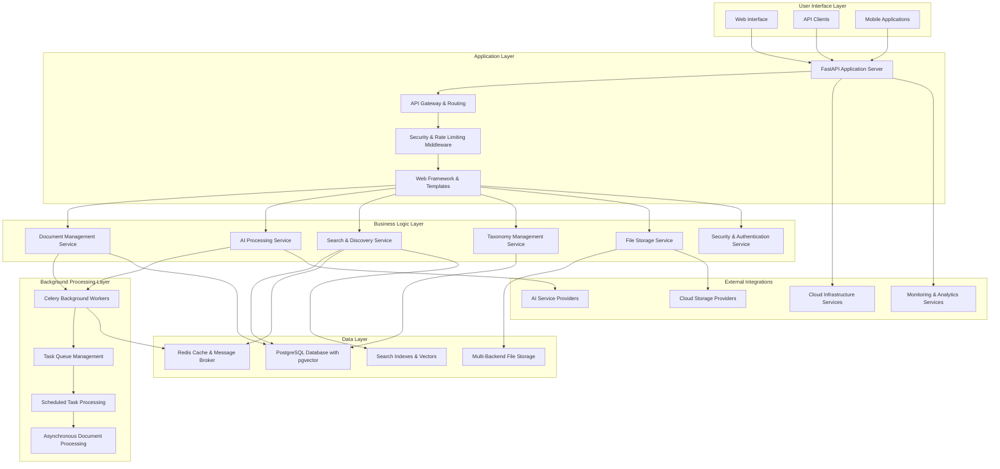
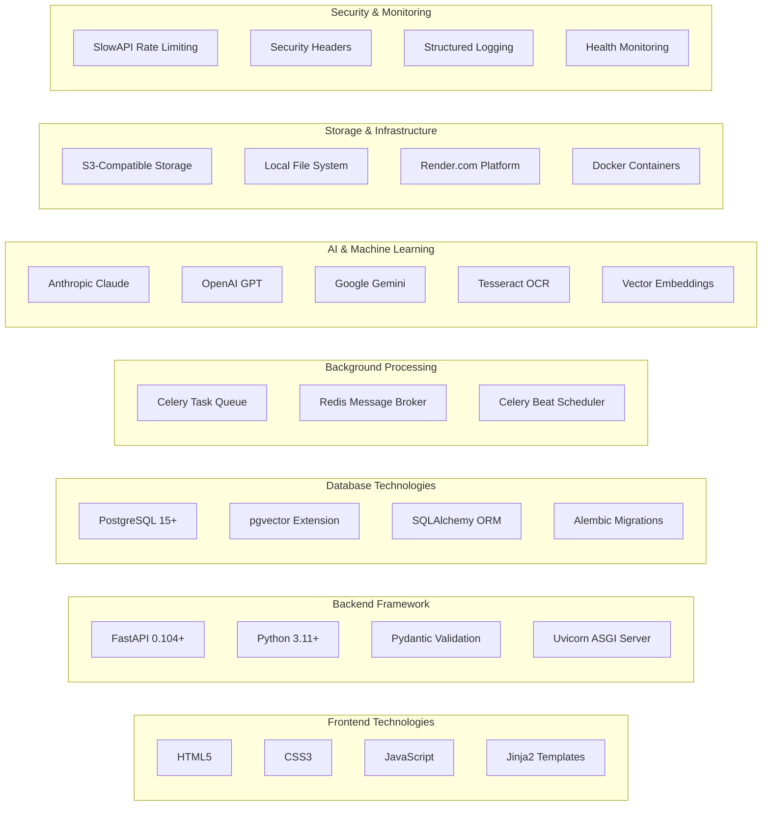
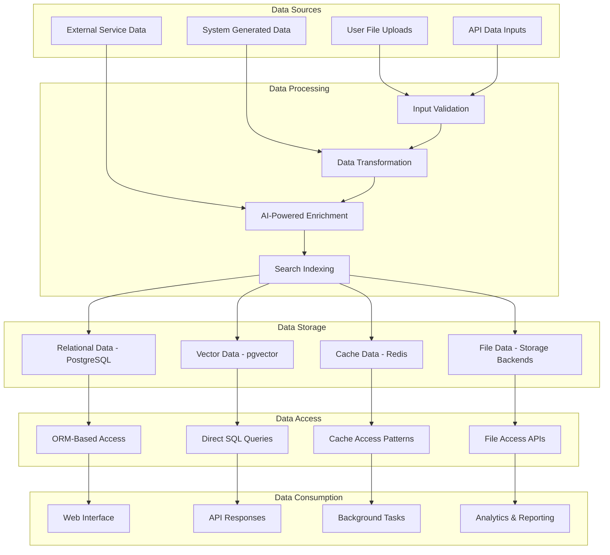
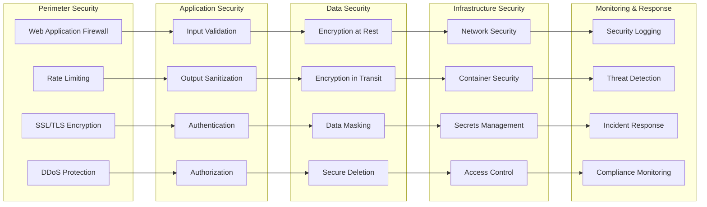
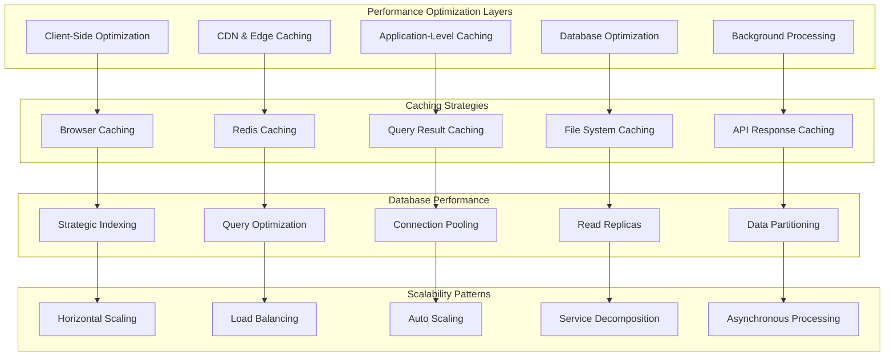
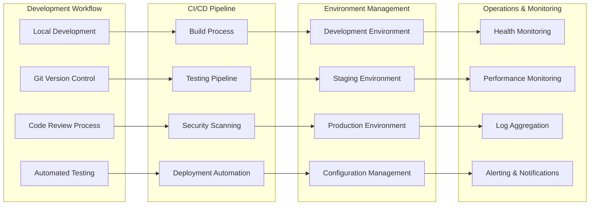

# Architecture Overview

## Document Catalog - Complete Application Architecture

This document provides a comprehensive overview of the Document Catalog application architecture, serving as a master index and high-level guide to all architectural components and their relationships.

## Architecture Documentation Index

### 📋 **Complete Architecture Suite**

1. **[System Architecture](system_architecture.md)** - High-level system overview and technology stack
2. **[Application Architecture](application_architecture.md)** - FastAPI application structure and API design
3. **[Data Flow Architecture](data_flow_architecture.md)** - Document processing and search workflows
4. **[Service Architecture](service_architecture.md)** - Business logic services and dependencies
5. **[Deployment Architecture](deployment_architecture.md)** - Infrastructure and deployment patterns
6. **[Security Architecture](security_architecture.md)** - Security and data protection measures
7. **[Integration Architecture](integration_architecture.md)** - External service integrations and API patterns
8. **[Database Schema](database_schema.md)** - Database design and relationships

## Executive Architecture Summary

## Core Architectural Principles

### 🏗️ **Design Principles**

#### **Separation of Concerns**

- Clear separation between presentation, business logic, and data layers
- Service-oriented architecture with well-defined boundaries
- Modular design enabling independent development and testing

#### **Scalability & Performance**

- Horizontal scaling through containerization and load balancing
- Asynchronous processing for CPU-intensive operations
- Multi-level caching strategies for optimal performance
- Database optimization with proper indexing and query patterns

#### **Reliability & Resilience**

- Fault-tolerant design with graceful degradation
- Circuit breaker patterns for external service calls
- Comprehensive error handling and recovery mechanisms
- Health checks and monitoring at all levels

#### **Security First**

- Defense-in-depth security architecture
- Input validation and output sanitization
- Secure authentication and authorization patterns
- Data encryption at rest and in transit

#### **Maintainability**

- Clean code architecture with SOLID principles
- Comprehensive documentation and API specifications
- Automated testing and continuous integration
- Configuration management and environment isolation

## Technology Stack Overview

## Key Architectural Patterns

### 🔄 **Design Patterns Used**

#### **Repository Pattern**

- Data access abstraction through service classes
- Clean separation between business logic and data persistence
- Testable and mockable data access layer

#### **Factory Pattern**

- Storage backend selection and instantiation
- AI provider selection and configuration
- Service instantiation based on environment

#### **Observer Pattern**

- Event-driven document processing workflows
- Status updates and progress tracking
- Cache invalidation on data changes

#### **Circuit Breaker Pattern**

- External service failure protection
- Automatic fallback mechanisms
- Service health monitoring and recovery

#### **Strategy Pattern**

- Multiple AI provider implementations
- Different storage backend strategies
- Configurable search algorithms

## Data Architecture Overview

## Security Architecture Summary

## Performance Architecture

## Deployment and Operations

## Quality Assurance Framework

### 🧪 **Testing Strategy**

#### **Unit Testing**

- Service-level unit tests with mocking
- Database model testing
- Utility function testing
- Configuration validation testing

#### **Integration Testing**

- API endpoint testing
- Database integration testing
- External service integration testing
- File storage integration testing

#### **End-to-End Testing**

- Complete workflow testing
- User interface testing
- Performance testing
- Security testing

#### **Quality Metrics**

- Code coverage targets (>80%)
- Performance benchmarks
- Security vulnerability scanning
- Dependency vulnerability monitoring

## Monitoring and Observability

### 📊 **Observability Stack**

#### **Metrics Collection**

- Application performance metrics
- Business logic metrics
- Infrastructure metrics
- Custom domain metrics

#### **Logging Strategy**

- Structured logging with JSON format
- Centralized log aggregation
- Log retention policies
- Security event logging

#### **Distributed Tracing**

- Request flow tracing
- Service dependency mapping
- Performance bottleneck identification
- Error propagation tracking

#### **Alerting Framework**

- Threshold-based alerting
- Anomaly detection
- Escalation policies
- Incident response automation

## Future Architecture Considerations

### 🚀 **Scalability Roadmap**

#### **Microservices Evolution**

- Service decomposition strategies
- API gateway implementation
- Service mesh adoption
- Event-driven architecture

#### **Advanced AI Integration**

- Custom model training
- Real-time inference optimization
- Multi-modal AI processing
- AI model versioning and deployment

#### **Enhanced Search Capabilities**

- Advanced vector search optimization
- Hybrid search algorithms
- Real-time search suggestions
- Personalized search results

#### **Global Scale Considerations**

- Multi-region deployment
- Data locality and compliance
- CDN optimization
- Internationalization support

## Architecture Decision Records (ADRs)

### 📝 **Key Architectural Decisions**

1. **FastAPI Framework Selection** - High performance, automatic documentation, strong typing
2. **PostgreSQL with pgvector** - ACID compliance, vector search capabilities, JSON support
3. **Celery for Background Processing** - Mature task queue, Redis integration, scalability
4. **Multi-Provider AI Strategy** - Vendor independence, cost optimization, redundancy
5. **Service Layer Architecture** - Clean separation of concerns, testability, maintainability
6. **Render.com Deployment** - Simplified deployment, managed services, cost-effectiveness

## Getting Started with the Architecture

### 📚 **Recommended Reading Order**

1. Start with **[System Architecture](system_architecture.md)** for the big picture
2. Review **[Application Architecture](application_architecture.md)** for FastAPI structure
3. Understand **[Data Flow Architecture](data_flow_architecture.md)** for workflows
4. Explore **[Service Architecture](service_architecture.md)** for business logic
5. Study **[Security Architecture](security_architecture.md)** for security patterns
6. Examine **[Deployment Architecture](deployment_architecture.md)** for infrastructure
7. Review **[Integration Architecture](integration_architecture.md)** for external services
8. Reference **[Database Schema](database_schema.md)** for data relationships

### 🛠️ **Development Guidelines**

- Follow the established service patterns when adding new features
- Maintain separation of concerns across architectural layers
- Implement comprehensive error handling and logging
- Write tests at multiple levels (unit, integration, end-to-end)
- Document architectural decisions and changes
- Consider security implications in all design decisions

This architecture overview provides a comprehensive guide to understanding and working with the Document Catalog application. Each architectural domain is thoroughly documented with detailed diagrams and implementation guidance, ensuring maintainability and scalability as the system evolves.
