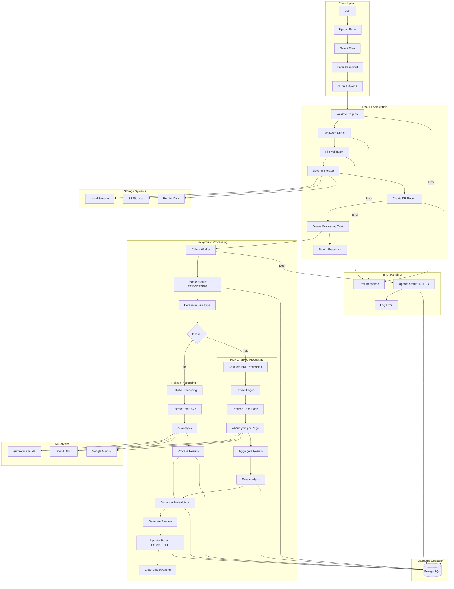
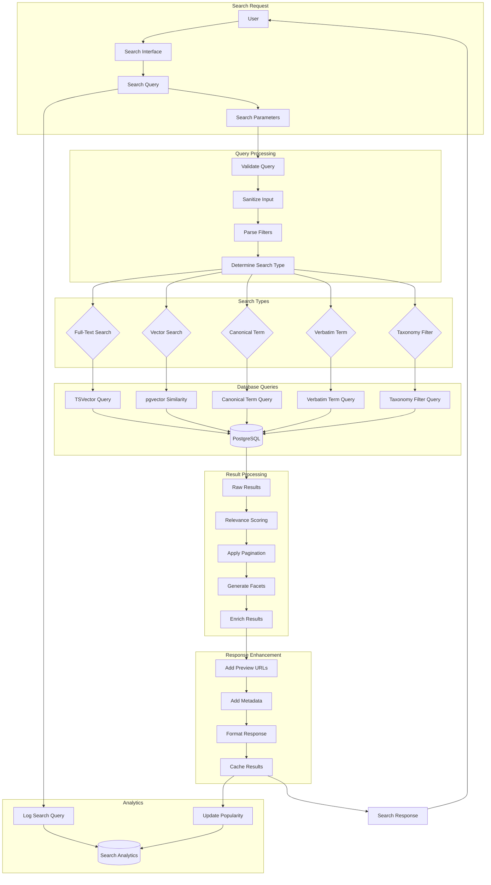
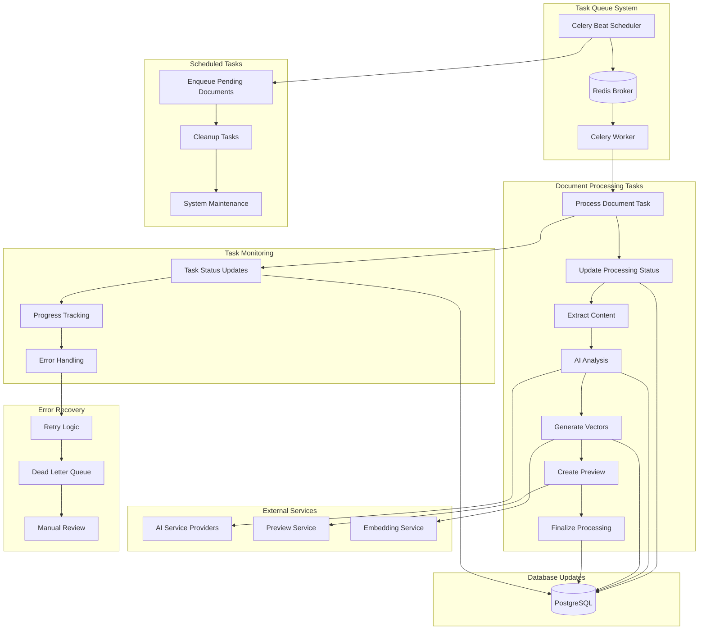
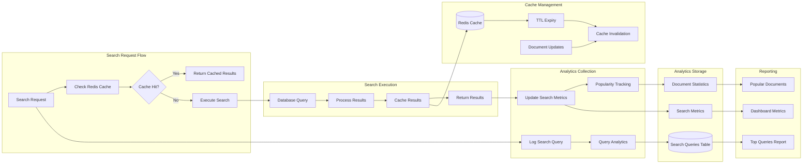
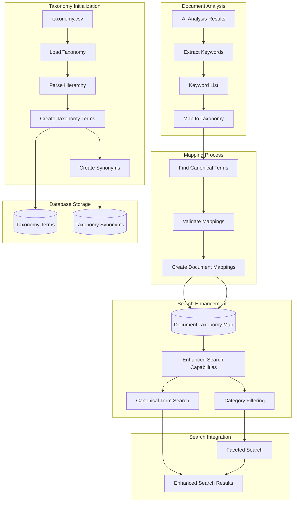
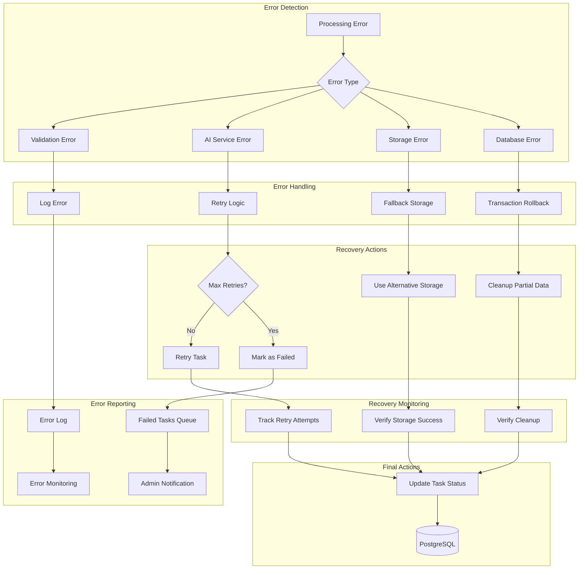

# Data Flow Architecture

## Document Catalog - Data Processing and Search Workflows

This document details the data flow architecture, focusing on document processing workflows, search and retrieval flows, and background processing pipelines.

## Document Upload and Processing Workflow

## Document Processing Pipeline Details

```mermaid
flowchart LR
    subgraph "Input Processing"
        FILE[Document File] --> TYPE_DETECTION[File Type Detection]
        TYPE_DETECTION --> PDF[PDF Files]
        TYPE_DETECTION --> IMAGE[Image Files]
        TYPE_DETECTION --> TEXT[Text Files]
        TYPE_DETECTION --> DOCX[DOCX Files]
    end

    subgraph "Text Extraction"
        PDF --> PDF_EXTRACT[PDF Text Extraction]
        IMAGE --> OCR[Tesseract OCR]
        TEXT --> DIRECT_READ[Direct Text Read]
        DOCX --> DOCX_EXTRACT[DOCX Text Extraction]

        PDF_EXTRACT --> EXTRACTED_TEXT[Extracted Text]
        OCR --> EXTRACTED_TEXT
        DIRECT_READ --> EXTRACTED_TEXT
        DOCX_EXTRACT --> EXTRACTED_TEXT
    end

    subgraph "AI Analysis"
        EXTRACTED_TEXT --> AI_PROMPT[AI Analysis Prompt]
        AI_PROMPT --> UNIFIED_ANALYSIS[Unified Analysis]
        AI_PROMPT --> MODULAR_ANALYSIS[Modular Analysis]
        AI_PROMPT --> SPECIFIC_ANALYSIS[Specific Analysis]

        UNIFIED_ANALYSIS --> AI_RESULTS[AI Analysis Results]
        MODULAR_ANALYSIS --> AI_RESULTS
        SPECIFIC_ANALYSIS --> AI_RESULTS
    end

    subgraph "Data Processing"
        AI_RESULTS --> EXTRACT_KEYWORDS[Extract Keywords]
        AI_RESULTS --> EXTRACT_CATEGORIES[Extract Categories]
        AI_RESULTS --> EXTRACT_MAPPINGS[Extract Mappings]
        AI_RESULTS --> EXTRACT_SUMMARY[Extract Summary]

        EXTRACT_KEYWORDS --> STRUCTURED_DATA[Structured Data]
        EXTRACT_CATEGORIES --> STRUCTURED_DATA
        EXTRACT_MAPPINGS --> STRUCTURED_DATA
        EXTRACT_SUMMARY --> STRUCTURED_DATA
    end

    subgraph "Vector Processing"
        STRUCTURED_DATA --> GENERATE_EMBEDDINGS[Generate Vector Embeddings]
        GENERATE_EMBEDDINGS --> VECTOR_STORAGE[Vector Storage]
    end

    subgraph "Database Storage"
        STRUCTURED_DATA --> UPDATE_DOCUMENT[Update Document Record]
        VECTOR_STORAGE --> UPDATE_EMBEDDINGS[Update Vector Embeddings]
        UPDATE_DOCUMENT --> POSTGRES[(PostgreSQL)]
        UPDATE_EMBEDDINGS --> POSTGRES
    end

    subgraph "Preview Generation"
        FILE --> PREVIEW_GEN[Preview Generation]
        PREVIEW_GEN --> PDF_PREVIEW[PDF Preview]
        PREVIEW_GEN --> IMAGE_PREVIEW[Image Preview]
        PDF_PREVIEW --> PREVIEW_STORAGE[Preview Storage]
        IMAGE_PREVIEW --> PREVIEW_STORAGE
    end
```

## Search and Retrieval Workflow

## Background Task Processing

## Search Analytics and Caching Flow

## Taxonomy and Keyword Mapping Flow

## File Storage and Preview Generation Flow

```mermaid
flowchart LR
    subgraph "File Upload"
        UPLOADED_FILE[Uploaded File] --> VALIDATE_FILE[Validate File]
        VALIDATE_FILE --> DETERMINE_STORAGE[Determine Storage Type]
    end

    subgraph "Storage Options"
        DETERMINE_STORAGE --> LOCAL_STORAGE[Local Storage]
        DETERMINE_STORAGE --> S3_STORAGE[S3 Storage]
        DETERMINE_STORAGE --> RENDER_DISK[Render Disk]

        LOCAL_STORAGE --> SAVE_LOCAL[Save to Local Path]
        S3_STORAGE --> SAVE_S3[Save to S3 Bucket]
        RENDER_DISK --> SAVE_RENDER[Save to Render Disk]
    end

    subgraph "Preview Generation"
        SAVE_LOCAL --> GENERATE_PREVIEW[Generate Preview]
        SAVE_S3 --> GENERATE_PREVIEW
        SAVE_RENDER --> GENERATE_PREVIEW

        GENERATE_PREVIEW --> PDF_PREVIEW[PDF Preview]
        GENERATE_PREVIEW --> IMAGE_PREVIEW[Image Preview]

        PDF_PREVIEW --> PREVIEW_IMAGE[Preview Image]
        IMAGE_PREVIEW --> PREVIEW_IMAGE
    end

    subgraph "Preview Storage"
        PREVIEW_IMAGE --> STORE_PREVIEW[Store Preview]
        STORE_PREVIEW --> PREVIEW_LOCAL[Local Preview Storage]
        STORE_PREVIEW --> PREVIEW_S3[S3 Preview Storage]
        STORE_PREVIEW --> PREVIEW_RENDER[Render Preview Storage]
    end

    subgraph "URL Generation"
        PREVIEW_LOCAL --> LOCAL_URL[Local Preview URL]
        PREVIEW_S3 --> S3_URL[S3 Presigned URL]
        PREVIEW_RENDER --> RENDER_URL[Render Preview URL]

        LOCAL_URL --> PREVIEW_URL[Preview URL]
        S3_URL --> PREVIEW_URL
        RENDER_URL --> PREVIEW_URL
    end

    subgraph "Database Update"
        SAVE_LOCAL --> UPDATE_FILE_PATH[Update File Path]
        SAVE_S3 --> UPDATE_FILE_PATH
        SAVE_RENDER --> UPDATE_FILE_PATH
        PREVIEW_URL --> UPDATE_PREVIEW_URL[Update Preview URL]

        UPDATE_FILE_PATH --> POSTGRES[(PostgreSQL)]
        UPDATE_PREVIEW_URL --> POSTGRES
    end
```

## Error Handling and Recovery Flow

## Performance Optimization Flow

```mermaid
flowchart LR
    subgraph "Request Optimization"
        INCOMING_REQUEST[Incoming Request] --> RATE_LIMITING[Rate Limiting]
        RATE_LIMITING --> CACHE_CHECK[Cache Check]
        CACHE_CHECK --> CACHE_HIT{Cache Hit?}
        CACHE_HIT -->|Yes| RETURN_CACHED[Return Cached Response]
        CACHE_HIT -->|No| PROCESS_REQUEST[Process Request]
    end

    subgraph "Database Optimization"
        PROCESS_REQUEST --> QUERY_OPTIMIZATION[Query Optimization]
        QUERY_OPTIMIZATION --> INDEX_USAGE[Index Usage]
        INDEX_USAGE --> CONNECTION_POOLING[Connection Pooling]
        CONNECTION_POOLING --> EXECUTE_QUERY[Execute Query]
    end

    subgraph "Background Processing Optimization"
        EXECUTE_QUERY --> ASYNC_PROCESSING[Async Processing]
        ASYNC_PROCESSING --> WORKER_SCALING[Worker Scaling]
        WORKER_SCALING --> TASK_PRIORITIZATION[Task Prioritization]
        TASK_PRIORITIZATION --> RESOURCE_MANAGEMENT[Resource Management]
    end

    subgraph "Response Optimization"
        EXECUTE_QUERY --> RESULT_PROCESSING[Result Processing]
        RESULT_PROCESSING --> PAGINATION[Pagination]
        PAGINATION --> COMPRESSION[Response Compression]
        COMPRESSION --> CACHE_RESPONSE[Cache Response]
    end

    subgraph "Monitoring and Metrics"
        CACHE_RESPONSE --> PERFORMANCE_METRICS[Performance Metrics]
        PERFORMANCE_METRICS --> SLOW_QUERY_LOG[Slow Query Log]
        SLOW_QUERY_LOG --> OPTIMIZATION_ALERTS[Optimization Alerts]
    end

    CACHE_RESPONSE --> RETURN_RESPONSE[Return Response]
    RETURN_CACHED --> RETURN_RESPONSE
```

## Key Data Flow Characteristics

### **Asynchronous Processing**

- Non-blocking document upload and processing
- Background task execution with Celery
- Real-time status updates and progress tracking
- Concurrent processing of multiple documents

### **Scalable Search Architecture**

- Multiple search strategies (full-text, vector, taxonomy)
- Intelligent caching with Redis
- Faceted search with dynamic filtering
- Performance-optimized database queries

### **Robust Error Handling**

- Comprehensive error detection and classification
- Automatic retry mechanisms with exponential backoff
- Graceful degradation and fallback strategies
- Detailed error logging and monitoring

### **Data Consistency**

- Transactional database operations
- Atomic updates for document processing
- Cache invalidation on data changes
- Consistent state management across services

### **Performance Optimization**

- Multi-level caching strategy
- Database query optimization
- Efficient file storage and retrieval
- Resource pooling and connection management

This data flow architecture ensures reliable, scalable, and performant document processing and search capabilities while maintaining data integrity and providing excellent user experience.
