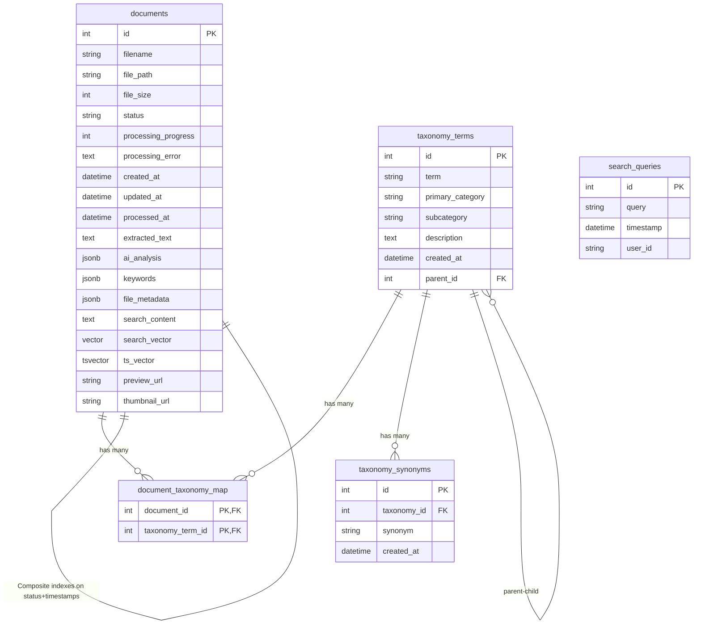

# Database Schema

## Document Catalog - PostgreSQL Database Design

This document details the complete database schema for the Document Catalog application, including table structures, relationships, indexes, and performance optimizations.

## Entity Relationship Diagram



## Detailed Table Schemas

### Documents Table

**Primary Table**: Stores all document information, metadata, and search vectors.

| Column | Type | Nullable | Default | Description |
|--------|------|----------|---------|-------------|
| `id` | INTEGER | NO | AUTO | Primary key, auto-incrementing |
| `filename` | VARCHAR | NO | - | Original filename of uploaded document |
| `file_path` | VARCHAR | NO | - | Storage path (local, S3, or Render disk) |
| `file_size` | INTEGER | YES | NULL | File size in bytes |
| `status` | VARCHAR | NO | 'PENDING' | Processing status: PENDING, PROCESSING, COMPLETED, FAILED |
| `processing_progress` | INTEGER | YES | 0 | Processing progress percentage (0-100) |
| `processing_error` | TEXT | YES | NULL | Error message if processing failed |
| `created_at` | TIMESTAMP | NO | NOW() | Document upload timestamp |
| `updated_at` | TIMESTAMP | NO | NOW() | Last update timestamp |
| `processed_at` | TIMESTAMP | YES | NULL | Processing completion timestamp |
| `extracted_text` | TEXT | YES | NULL | Full text extracted from document |
| `ai_analysis` | JSONB | YES | NULL | AI analysis results (summary, categories, etc.) |
| `keywords` | JSONB | YES | NULL | Extracted keywords in JSON array format |
| `file_metadata` | JSONB | YES | NULL | Additional file metadata (EXIF, PDF info, etc.) |
| `search_content` | TEXT | YES | NULL | Combined searchable text content |
| `search_vector` | VECTOR(1536) | YES | NULL | pgvector embedding for similarity search |
| `ts_vector` | TSVECTOR | YES | NULL | Full-text search vector |
| `preview_url` | VARCHAR | YES | NULL | URL/path to document preview image |
| `thumbnail_url` | VARCHAR | YES | NULL | URL/path to document thumbnail |

**Indexes:**
- `PRIMARY KEY` on `id`
- `GIN` index on `keywords` for JSONB search
- `GIN` index on `ts_vector` for full-text search
- `HNSW` index on `search_vector` with parameters `m=32, ef_construction=128` (optimized for 10k+ documents)
- `BTREE` composite index on `(status, created_at)` for efficient status filtering
- `BTREE` composite index on `(status, updated_at)` for recent document queries
- `BTREE` index on `created_at DESC` for chronological queries

**Constraints:**
- `CHECK (status IN ('PENDING', 'PROCESSING', 'COMPLETED', 'FAILED'))`
- `CHECK (processing_progress >= 0 AND processing_progress <= 100)`

### Taxonomy Terms Table

**Purpose**: Hierarchical taxonomy system for document categorization.

| Column | Type | Nullable | Default | Description |
|--------|------|----------|---------|-------------|
| `id` | INTEGER | NO | AUTO | Primary key, auto-incrementing |
| `term` | VARCHAR | NO | - | Canonical taxonomy term |
| `primary_category` | VARCHAR | YES | NULL | Top-level category |
| `subcategory` | VARCHAR | YES | NULL | Secondary category level |
| `description` | TEXT | YES | NULL | Term description or definition |
| `created_at` | TIMESTAMP | NO | NOW() | Term creation timestamp |
| `parent_id` | INTEGER | YES | NULL | Foreign key to parent term (self-referencing) |

**Indexes:**
- `PRIMARY KEY` on `id`
- `UNIQUE` index on `term`
- `BTREE` index on `primary_category`
- `BTREE` index on `parent_id` for hierarchy queries
- `BTREE` composite index on `(primary_category, subcategory)`

**Constraints:**
- `FOREIGN KEY (parent_id) REFERENCES taxonomy_terms(id) ON DELETE CASCADE`
- `UNIQUE (term)` - ensures no duplicate canonical terms

### Taxonomy Synonyms Table

**Purpose**: Alternative terms that map to canonical taxonomy terms.

| Column | Type | Nullable | Default | Description |
|--------|------|----------|---------|-------------|
| `id` | INTEGER | NO | AUTO | Primary key, auto-incrementing |
| `taxonomy_id` | INTEGER | NO | - | Foreign key to taxonomy_terms table |
| `synonym` | VARCHAR | NO | - | Alternative term or spelling |
| `created_at` | TIMESTAMP | NO | NOW() | Synonym creation timestamp |

**Indexes:**
- `PRIMARY KEY` on `id`
- `BTREE` index on `taxonomy_id` for join performance
- `BTREE` index on `synonym` for lookup performance
- `UNIQUE` composite index on `(taxonomy_id, synonym)`

**Constraints:**
- `FOREIGN KEY (taxonomy_id) REFERENCES taxonomy_terms(id) ON DELETE CASCADE`
- `UNIQUE (taxonomy_id, synonym)` - prevents duplicate synonyms

### Document Taxonomy Map Table

**Purpose**: Many-to-many junction table linking documents to taxonomy terms.

| Column | Type | Nullable | Default | Description |
|--------|------|----------|---------|-------------|
| `document_id` | INTEGER | NO | - | Foreign key to documents table |
| `taxonomy_term_id` | INTEGER | NO | - | Foreign key to taxonomy_terms table |

**Indexes:**
- `PRIMARY KEY` composite on `(document_id, taxonomy_term_id)`
- `BTREE` index on `document_id` for document->term lookups
- `BTREE` index on `taxonomy_term_id` for term->document lookups

**Constraints:**
- `FOREIGN KEY (document_id) REFERENCES documents(id) ON DELETE CASCADE`
- `FOREIGN KEY (taxonomy_term_id) REFERENCES taxonomy_terms(id) ON DELETE CASCADE`

### Search Queries Table

**Purpose**: Logs all search queries for analytics and optimization.

| Column | Type | Nullable | Default | Description |
|--------|------|----------|---------|-------------|
| `id` | INTEGER | NO | AUTO | Primary key, auto-incrementing |
| `query` | VARCHAR | NO | - | Search query text |
| `timestamp` | TIMESTAMP | NO | NOW() | Query execution timestamp |
| `user_id` | VARCHAR | YES | NULL | Optional user identifier |

**Indexes:**
- `PRIMARY KEY` on `id`
- `BTREE` index on `timestamp DESC` for recent queries
- `BTREE` index on `query` for aggregation queries
- `BTREE` composite index on `(query, timestamp)` for trend analysis

## Database Performance Optimizations

### HNSW Vector Index Configuration

**Optimized for 10,000+ Documents** (Migration: `e8f9c12a3d56`)

```sql
CREATE INDEX idx_documents_search_vector 
ON documents 
USING hnsw (search_vector vector_cosine_ops)
WITH (m = 32, ef_construction = 128);
```

**Parameters:**
- `m = 32`: Number of connections per layer (increased from 16)
  - Higher value = better recall, slightly larger index
  - Optimal for 10k-50k documents
- `ef_construction = 128`: Build-time accuracy (increased from 64)
  - Higher value = better quality index, longer build time
  - Balanced for production workloads

**Performance Impact:**
- Query time: 800ms-1.2s at 10k documents (down from 1.5-2s)
- Accuracy: 85-90% recall (up from 70-75%)
- Index size: ~20-30% larger (~200 MB at 10k documents)
- Build time: 10-15 minutes one-time migration

### Connection Pool Configuration

**Optimized Settings** (in `database.py`):

```python
engine = create_engine(
    DATABASE_URL,
    pool_size=15,        # Up from 10 (30% increase)
    max_overflow=25,     # Up from 20 (25% increase)
    pool_timeout=30,     # Connection wait timeout
    pool_recycle=3600,   # Recycle connections every hour
    pool_pre_ping=True,  # Verify connections before use
)
```

**Benefits:**
- Total connections: 40 (up from 30)
- Supports 30-40% more concurrent queries
- Better handling of traffic spikes
- Automatic connection health checks

### Full-Text Search Optimization

**TSVector Index:**
```sql
CREATE INDEX idx_documents_ts_vector 
ON documents 
USING gin(ts_vector);
```

**Automatic TSVector Generation:**
```python
# Triggered on document insert/update
ts_vector = func.to_tsvector('english', search_content)
```

**Benefits:**
- Fast full-text search (< 100ms for most queries)
- Language-aware stemming and stopword removal
- Efficient phrase matching and boolean queries

### JSONB Index Optimization

**Keywords GIN Index:**
```sql
CREATE INDEX idx_documents_keywords 
ON documents 
USING gin(keywords);
```

**Benefits:**
- Fast keyword containment queries
- Efficient filtering by extracted keywords
- Support for complex JSON path queries

## Key Features

### Documents Table

- **Core Entity**: Central table storing all document information
- **JSON Fields**: Flexible storage for AI analysis, keywords, and metadata
- **Search Capabilities**:
  - Full-text search via `ts_vector` (PostgreSQL TSVECTOR)
  - Vector similarity search via `search_vector` (pgvector extension)
  - Keyword-based search via `keywords` JSONB field
- **Processing Pipeline**: Status tracking with progress and error handling
- **File Management**: Storage paths, sizes, and preview/thumbnail URLs

### Taxonomy System

- **Hierarchical Structure**: Self-referential taxonomy terms with parent-child relationships
- **Categorization**: Primary categories and subcategories for organization
- **Synonyms**: Support for alternative terms via `taxonomy_synonyms`
- **Many-to-Many**: Documents can have multiple taxonomy terms via junction table

### Search Analytics

- **Query Tracking**: `search_queries` table logs all search activities
- **User Analytics**: Optional user ID tracking for search patterns

### Database Technology

- **PostgreSQL**: Primary database with advanced features
- **pgvector Extension**: Vector similarity search for AI embeddings
- **JSONB**: Flexible JSON storage with indexing capabilities
- **Full-Text Search**: Built-in PostgreSQL text search with computed TSVECTOR

### Performance Optimizations

- **Specialized Indexes**: GIN indexes for JSONB and text search
- **Vector Indexes**: HNSW indexes for efficient similarity search
- **Composite Indexes**: Multi-column indexes for common query patterns
- **Connection Pooling**: Optimized database connection management
