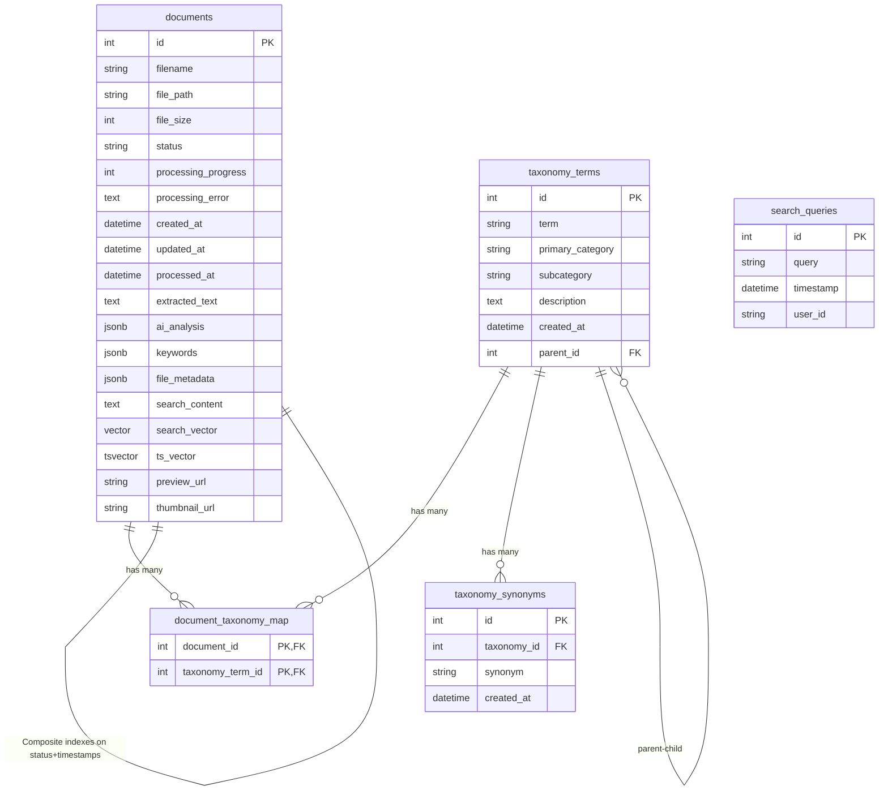

# Database Schema - Mermaid Chart

## Key Features

### Documents Table

- **Core Entity**: Central table storing all document information
- **JSON Fields**: Flexible storage for AI analysis, keywords, and metadata
- **Search Capabilities**:
  - Full-text search via `ts_vector` (PostgreSQL TSVECTOR)
  - Vector similarity search via `search_vector` (pgvector extension)
  - Keyword-based search via `keywords` JSONB field
- **Processing Pipeline**: Status tracking with progress and error handling
- **File Management**: Storage paths, sizes, and preview/thumbnail URLs

### Taxonomy System

- **Hierarchical Structure**: Self-referential taxonomy terms with parent-child relationships
- **Categorization**: Primary categories and subcategories for organization
- **Synonyms**: Support for alternative terms via `taxonomy_synonyms`
- **Many-to-Many**: Documents can have multiple taxonomy terms via junction table

### Search Analytics

- **Query Tracking**: `search_queries` table logs all search activities
- **User Analytics**: Optional user ID tracking for search patterns

### Database Technology

- **PostgreSQL**: Primary database with advanced features
- **pgvector Extension**: Vector similarity search for AI embeddings
- **JSONB**: Flexible JSON storage with indexing capabilities
- **Full-Text Search**: Built-in PostgreSQL text search with computed TSVECTOR

### Performance Optimizations

- **Specialized Indexes**: GIN indexes for JSONB and text search
- **Vector Indexes**: HNSW indexes for efficient similarity search
- **Composite Indexes**: Multi-column indexes for common query patterns
- **Connection Pooling**: Optimized database connection management
