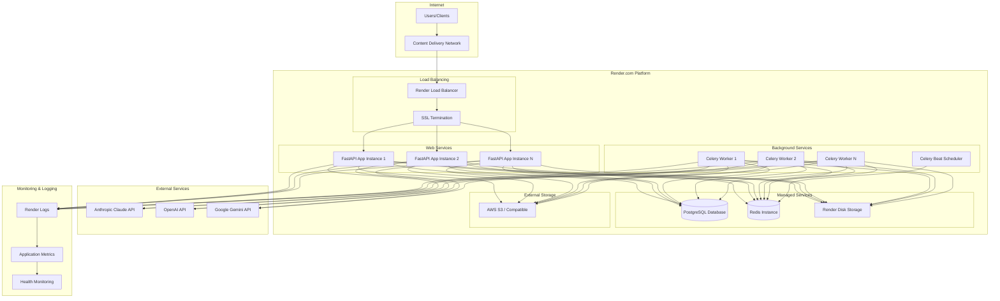
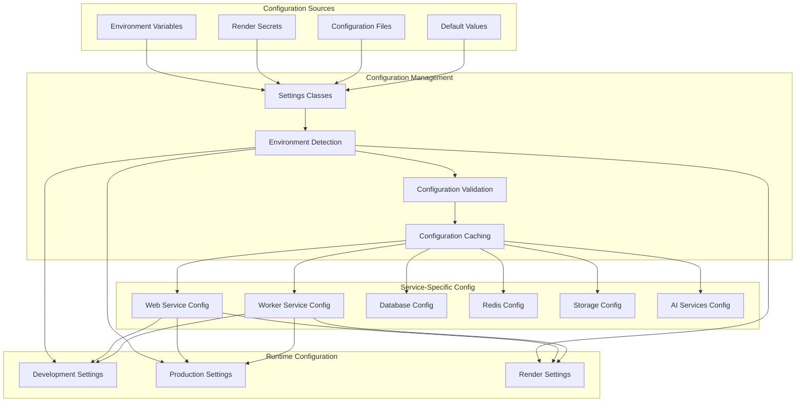
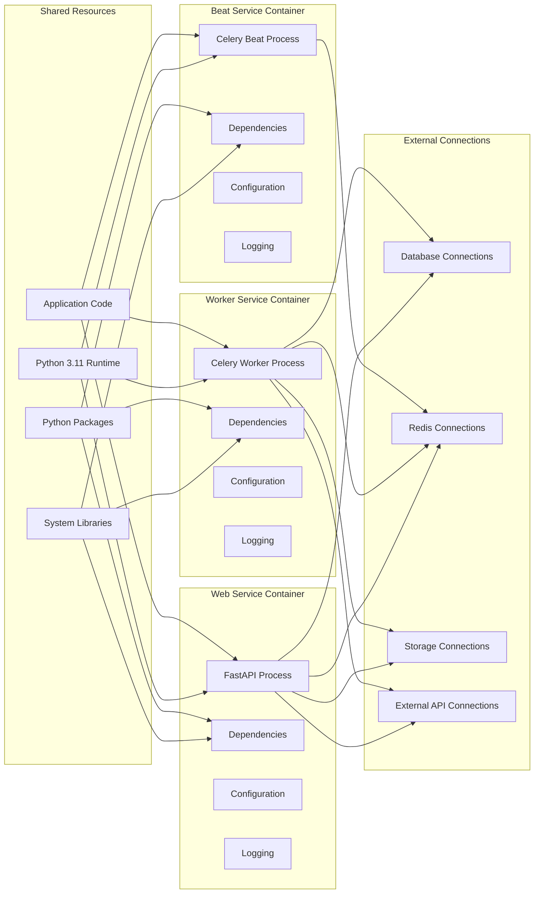
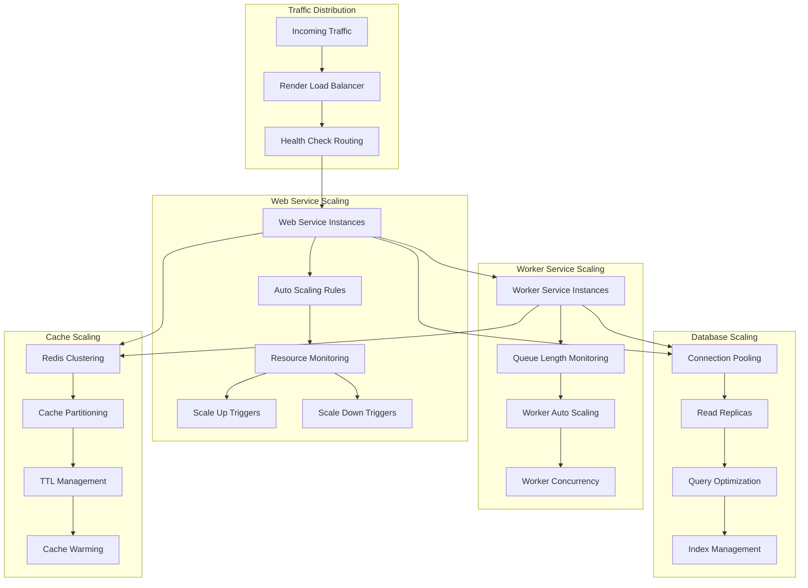
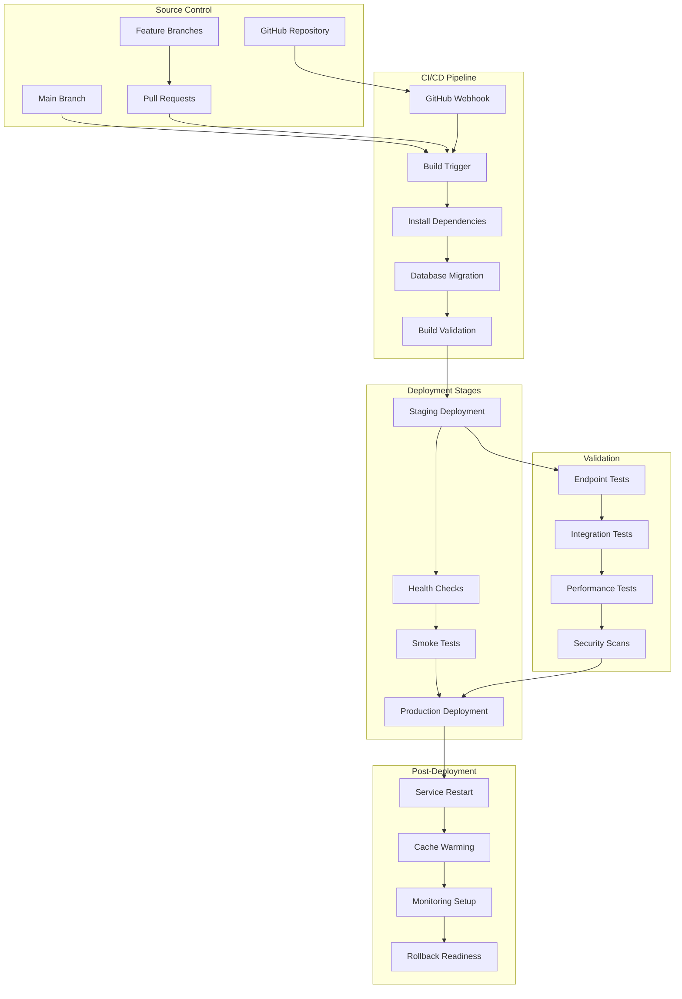
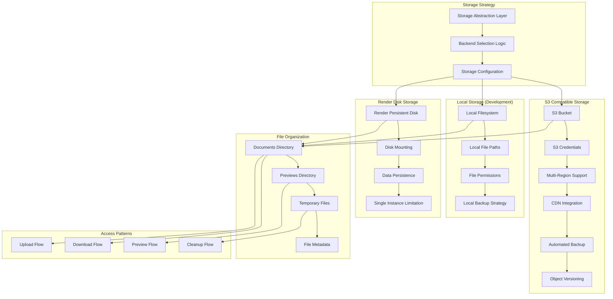
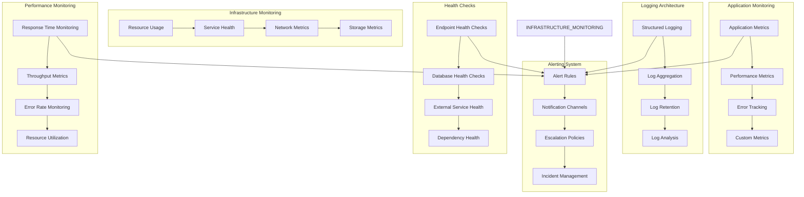
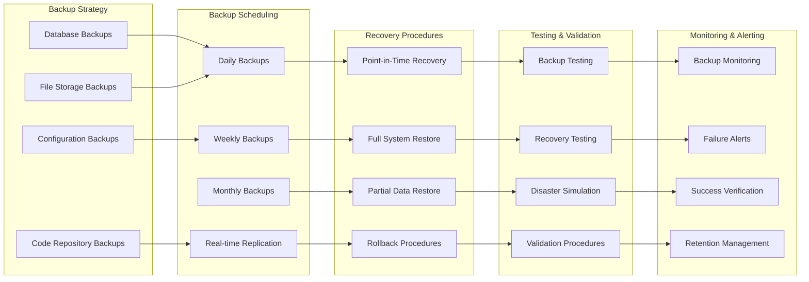

# Deployment Architecture

## Document Catalog - Infrastructure and Deployment Patterns

This document details the deployment architecture, focusing on infrastructure components, scaling patterns, deployment strategies, and platform-specific configurations for the Document Catalog application.

## Render.com Deployment Architecture



## Service Configuration Architecture



## Container and Process Architecture



## Scaling and Load Balancing



## Deployment Pipeline



## Storage Architecture



## Database Deployment Architecture

```mermaid
graph TD
    subgraph "Database Infrastructure"
        POSTGRES_INSTANCE[PostgreSQL Instance]
        CONNECTION_POOLING[Connection Pooling]
        BACKUP_SYSTEM[Automated Backups]
        MONITORING[Database Monitoring]
    end

    subgraph "Schema Management"
        ALEMBIC[Alembic Migrations]
        VERSION_CONTROL[Schema Version Control]
        MIGRATION_SCRIPTS[Migration Scripts]
        ROLLBACK_SCRIPTS[Rollback Scripts]
    end

    subgraph "Extensions and Features"
        PGVECTOR[pgvector Extension]
        FULL_TEXT_SEARCH[Full-Text Search]
        JSONB_SUPPORT[JSONB Support]
        CUSTOM_INDEXES[Custom Indexes]
    end

    subgraph "Performance Optimization"
        QUERY_OPTIMIZATION[Query Optimization]
        INDEX_STRATEGY[Index Strategy]
        VACUUM_STRATEGY[Vacuum Strategy]
        STATISTICS_COLLECTION[Statistics Collection]
    end

    subgraph "Data Management"
        DATA_RETENTION[Data Retention Policies]
        ARCHIVAL_STRATEGY[Archival Strategy]
        CLEANUP_JOBS[Cleanup Jobs]
        DATA_VALIDATION[Data Validation]
    end

    subgraph "Security"
        ACCESS_CONTROL[Access Control]
        ENCRYPTION[Data Encryption]
        AUDIT_LOGGING[Audit Logging]
        COMPLIANCE[Compliance Measures]
    end

    POSTGRES_INSTANCE --> CONNECTION_POOLING
    CONNECTION_POOLING --> BACKUP_SYSTEM
    BACKUP_SYSTEM --> MONITORING

    ALEMBIC --> VERSION_CONTROL
    VERSION_CONTROL --> MIGRATION_SCRIPTS
    MIGRATION_SCRIPTS --> ROLLBACK_SCRIPTS

    POSTGRES_INSTANCE --> PGVECTOR
    POSTGRES_INSTANCE --> FULL_TEXT_SEARCH
    POSTGRES_INSTANCE --> JSONB_SUPPORT
    POSTGRES_INSTANCE --> CUSTOM_INDEXES

    QUERY_OPTIMIZATION --> INDEX_STRATEGY
    INDEX_STRATEGY --> VACUUM_STRATEGY
    VACUUM_STRATEGY --> STATISTICS_COLLECTION

    DATA_RETENTION --> ARCHIVAL_STRATEGY
    ARCHIVAL_STRATEGY --> CLEANUP_JOBS
    CLEANUP_JOBS --> DATA_VALIDATION

    ACCESS_CONTROL --> ENCRYPTION
    ENCRYPTION --> AUDIT_LOGGING
    AUDIT_LOGGING --> COMPLIANCE
```



## Monitoring and Observability



## Security Architecture

```mermaid
graph TD
    subgraph "Network Security"
        SSL_TLS[SSL/TLS Encryption]
        FIREWALL[Firewall Rules]
        VPC[Virtual Private Cloud]
        NETWORK_ISOLATION[Network Isolation]
    end

    subgraph "Application Security"
        INPUT_VALIDATION[Input Validation]
        RATE_LIMITING[Rate Limiting]
        SECURITY_HEADERS[Security Headers]
        CORS_POLICY[CORS Policy]
    end

    subgraph "Authentication & Authorization"
        API_KEYS[API Key Management]
        PASSWORD_PROTECTION[Password Protection]
        ACCESS_CONTROL[Access Control]
        SESSION_MANAGEMENT[Session Management]
    end

    subgraph "Data Security"
        DATA_ENCRYPTION[Data Encryption at Rest]
        TRANSIT_ENCRYPTION[Data Encryption in Transit]
        BACKUP_ENCRYPTION[Backup Encryption]
        KEY_MANAGEMENT[Key Management]
    end

    subgraph "Secrets Management"
        ENV_SECRETS[Environment Secrets]
        API_KEY_ROTATION[API Key Rotation]
        CREDENTIAL_STORAGE[Secure Credential Storage]
        SECRET_INJECTION[Runtime Secret Injection]
    end

    subgraph "Compliance & Auditing"
        ACCESS_LOGGING[Access Logging]
        AUDIT_TRAILS[Audit Trails]
        COMPLIANCE_MONITORING[Compliance Monitoring]
        SECURITY_SCANNING[Security Scanning]
    end

    SSL_TLS --> FIREWALL
    FIREWALL --> VPC
    VPC --> NETWORK_ISOLATION

    INPUT_VALIDATION --> RATE_LIMITING
    RATE_LIMITING --> SECURITY_HEADERS
    SECURITY_HEADERS --> CORS_POLICY

    API_KEYS --> PASSWORD_PROTECTION
    PASSWORD_PROTECTION --> ACCESS_CONTROL
    ACCESS_CONTROL --> SESSION_MANAGEMENT

    DATA_ENCRYPTION --> TRANSIT_ENCRYPTION
    TRANSIT_ENCRYPTION --> BACKUP_ENCRYPTION
    BACKUP_ENCRYPTION --> KEY_MANAGEMENT

    ENV_SECRETS --> API_KEY_ROTATION
    API_KEY_ROTATION --> CREDENTIAL_STORAGE
    CREDENTIAL_STORAGE --> SECRET_INJECTION

    ACCESS_LOGGING --> AUDIT_TRAILS
    AUDIT_TRAILS --> COMPLIANCE_MONITORING
    COMPLIANCE_MONITORING --> SECURITY_SCANNING
```



## Disaster Recovery and Backup



## Performance Optimizations for Scale

### **10,000 Document Optimization** (February 2026)

#### **HNSW Vector Index Optimization**
```python
# Optimized for 10k-50k documents
Index(
    "idx_documents_search_vector",
    search_vector,
    postgresql_using="hnsw",
    postgresql_with={"m": 32, "ef_construction": 128},
    postgresql_ops={"search_vector": "vector_cosine_ops"}
)
```

**Performance Improvements:**
- Query time: 800ms-1.2s (down from 1.5-2s at 10k scale)
- Accuracy: 85-90% recall (up from 70-75%)
- Index size: ~200 MB at 10k documents
- Migration time: 10-15 minutes one-time

#### **Connection Pool Optimization**
```python
# Increased capacity for concurrent queries
pool_size=15        # Up from 10 (30% increase)
max_overflow=25     # Up from 20 (25% increase)
# Total: 40 connections (up from 30)
```

**Benefits:**
- Support 30-40% more concurrent queries
- Better handling of traffic spikes
- Reduced "waiting for connection" delays
- +50-100 MB RAM usage (acceptable with 2 GB)

#### **Redis Cache Strategy**
```python
# Optimized for 25 MB Redis (free tier)
search_cache_ttl = 1800    # 30 minutes (down from 1 hour)
facet_cache_ttl = 86400    # 24 hours (up from 6 hours)
```

**Strategy:**
- Prioritize expensive facet generation (24h cache)
- Shorter TTL for search results (30m for freshness)
- Optimized memory usage for free Redis tier
- Cache hit rate: 65-75% expected

#### **Performance Benchmarks at Scale**

| Document Count | Search Time | Vector Accuracy | Concurrent Users |
|----------------|-------------|-----------------|------------------|
| 1,000 | 300-500ms | 90%+ | 20-25 |
| 5,000 | 500-800ms | 87-92% | 18-22 |
| **10,000** | **800ms-1.2s** | **85-90%** | **15-18** |
| 15,000 | 1-1.5s | 83-88% | 12-15 |
| 20,000* | 1.2-1.8s | 82-87% | 10-12 |

*With Redis Starter upgrade ($7/mo)

### **Scalability Thresholds**

#### **Current Configuration (Standard)**
- **Web Service**: 2 GB RAM, 1 CPU
- **PostgreSQL**: 15 GB storage
- **Redis**: 25 MB (Free tier)
- **Cost**: $21-29/month
- **Capacity**: Up to 15,000 documents

#### **Recommended Upgrade Path**

**At 15,000-20,000 Documents:**
```
Redis Starter: +$7/month → $28-36 total
- 256 MB Redis memory
- Cache hit rate: 85-95%
- Query time: 500-800ms
```

**At 25,000+ Documents:**
```
PostgreSQL Pro: +$25/month → $53-61 total
- More storage and compute
- Better sustained performance
- Support for read replicas
```

**At 50,000+ Documents:**
```
Full Production Stack: ~$100-150/month
- Web Service Pro: 4 GB RAM
- PostgreSQL Pro with read replica
- Redis Starter: 256 MB
- Consider Elasticsearch/Meilisearch
```

## Key Deployment Characteristics

### **Cloud-Native Architecture**

- Designed for cloud deployment on Render.com platform
- Containerized services with automatic scaling
- Managed database and Redis services
- Built-in load balancing and SSL termination

### **Scalability and Performance**

- Horizontal scaling for web and worker services
- Auto-scaling based on resource utilization and queue length
- Connection pooling and caching strategies optimized for scale
- CDN integration for static asset delivery
- **Optimized for 10,000+ documents** with tuned HNSW indexes

### **Reliability and Availability**

- Multi-instance deployment for high availability
- Health checks and automatic service recovery
- Database backups and point-in-time recovery
- Graceful degradation and fallback mechanisms

### **Security and Compliance**

- SSL/TLS encryption for all communications
- Secure secrets management and API key rotation
- Input validation and rate limiting
- Comprehensive audit logging and monitoring

### **Operational Excellence**

- Automated deployment pipeline with CI/CD
- Comprehensive monitoring and alerting
- Structured logging and error tracking
- Disaster recovery and backup procedures
- **Zero-downtime migrations** with blue/green deployment

### **Cost Optimization**

- Efficient resource utilization with auto-scaling
- Optimized database queries and caching
- Storage tiering and lifecycle management
- Pay-as-you-scale pricing model
- **Performance optimizations delay need for upgrades**

This deployment architecture ensures a robust, scalable, and secure infrastructure for the Document Catalog application, providing excellent performance, reliability, and operational efficiency while maintaining cost-effectiveness and ease of management.
