# Integration Architecture

## Document Catalog - External Service Integrations and API Patterns

This document details the integration architecture, focusing on external service integrations, API patterns, data exchange protocols, and third-party service management for the Document Catalog application.

## Integration Overview

```mermaid
graph TB
    subgraph "Document Catalog Core"
        FASTAPI_APP[FastAPI Application]
        CELERY_WORKERS[Celery Workers]
        DATABASE[PostgreSQL Database]
        REDIS_CACHE[Redis Cache]
    end

    subgraph "AI Service Integrations"
        ANTHROPIC_API[Anthropic Claude API]
        OPENAI_API[OpenAI GPT API]
        GEMINI_API[Google Gemini API]
        OCR_ENGINE[Tesseract OCR Engine]
    end

    subgraph "Storage Integrations"
        AWS_S3[AWS S3]
        S3_COMPATIBLE[S3-Compatible Storage]
        LOCAL_STORAGE[Local File System]
        RENDER_DISK[Render Persistent Disk]
    end

    subgraph "Infrastructure Services"
        RENDER_PLATFORM[Render.com Platform]
        RENDER_POSTGRES[Render PostgreSQL]
        RENDER_REDIS[Render Redis]
        RENDER_LOGS[Render Logging]
    end

    subgraph "Monitoring & Analytics"
        APPLICATION_METRICS[Application Metrics]
        ERROR_TRACKING[Error Tracking]
        PERFORMANCE_MONITORING[Performance Monitoring]
        HEALTH_CHECKS[Health Check Services]
    end

    subgraph "Security Services"
        SSL_CERTIFICATES[SSL Certificate Providers]
        SECRETS_MANAGEMENT[Secrets Management]
        RATE_LIMITING[Rate Limiting Services]
        SECURITY_SCANNING[Security Scanning]
    end

    FASTAPI_APP --> ANTHROPIC_API
    FASTAPI_APP --> OPENAI_API
    FASTAPI_APP --> GEMINI_API
    CELERY_WORKERS --> ANTHROPIC_API
    CELERY_WORKERS --> OPENAI_API
    CELERY_WORKERS --> GEMINI_API
    CELERY_WORKERS --> OCR_ENGINE

    FASTAPI_APP --> AWS_S3
    FASTAPI_APP --> S3_COMPATIBLE
    FASTAPI_APP --> LOCAL_STORAGE
    FASTAPI_APP --> RENDER_DISK
    CELERY_WORKERS --> AWS_S3
    CELERY_WORKERS --> S3_COMPATIBLE
    CELERY_WORKERS --> LOCAL_STORAGE
    CELERY_WORKERS --> RENDER_DISK

    FASTAPI_APP --> RENDER_PLATFORM
    DATABASE --> RENDER_POSTGRES
    REDIS_CACHE --> RENDER_REDIS
    FASTAPI_APP --> RENDER_LOGS
    CELERY_WORKERS --> RENDER_LOGS

    FASTAPI_APP --> APPLICATION_METRICS
    FASTAPI_APP --> ERROR_TRACKING
    FASTAPI_APP --> PERFORMANCE_MONITORING
    FASTAPI_APP --> HEALTH_CHECKS

    FASTAPI_APP --> SSL_CERTIFICATES
    FASTAPI_APP --> SECRETS_MANAGEMENT
    FASTAPI_APP --> RATE_LIMITING
    FASTAPI_APP --> SECURITY_SCANNING
```

## AI Service Integration Architecture

```mermaid
graph TD
    subgraph "AI Service Abstraction"
        AI_SERVICE[AIService Class]
        PROVIDER_SELECTION[Provider Selection Logic]
        FALLBACK_MECHANISM[Fallback Mechanism]
        LOAD_BALANCING[Load Balancing]
    end

    subgraph "Anthropic Integration"
        ANTHROPIC_CLIENT[Anthropic Client]
        CLAUDE_MODELS[Claude Models]
        ANTHROPIC_AUTH[API Key Authentication]
        ANTHROPIC_RATE_LIMITS[Rate Limiting]
        ANTHROPIC_ERROR_HANDLING[Error Handling]
    end

    subgraph "OpenAI Integration"
        OPENAI_CLIENT[OpenAI Client]
        GPT_MODELS[GPT Models]
        OPENAI_AUTH[API Key Authentication]
        OPENAI_RATE_LIMITS[Rate Limiting]
        OPENAI_ERROR_HANDLING[Error Handling]
    end

    subgraph "Google Gemini Integration"
        GEMINI_CLIENT[Gemini Client]
        GEMINI_MODELS[Gemini Models]
        GEMINI_AUTH[API Key Authentication]
        GEMINI_RATE_LIMITS[Rate Limiting]
        GEMINI_ERROR_HANDLING[Error Handling]
    end

    subgraph "Request Processing"
        REQUEST_FORMATTING[Request Formatting]
        PROMPT_MANAGEMENT[Prompt Management]
        RESPONSE_PARSING[Response Parsing]
        RESULT_VALIDATION[Result Validation]
    end

    subgraph "Error Handling & Retry"
        CIRCUIT_BREAKER[Circuit Breaker Pattern]
        EXPONENTIAL_BACKOFF[Exponential Backoff]
        RETRY_LOGIC[Retry Logic]
        FALLBACK_RESPONSES[Fallback Responses]
    end

    AI_SERVICE --> PROVIDER_SELECTION
    PROVIDER_SELECTION --> FALLBACK_MECHANISM
    FALLBACK_MECHANISM --> LOAD_BALANCING

    PROVIDER_SELECTION --> ANTHROPIC_CLIENT
    PROVIDER_SELECTION --> OPENAI_CLIENT
    PROVIDER_SELECTION --> GEMINI_CLIENT

    ANTHROPIC_CLIENT --> CLAUDE_MODELS
    ANTHROPIC_CLIENT --> ANTHROPIC_AUTH
    ANTHROPIC_CLIENT --> ANTHROPIC_RATE_LIMITS
    ANTHROPIC_CLIENT --> ANTHROPIC_ERROR_HANDLING

    OPENAI_CLIENT --> GPT_MODELS
    OPENAI_CLIENT --> OPENAI_AUTH
    OPENAI_CLIENT --> OPENAI_RATE_LIMITS
    OPENAI_CLIENT --> OPENAI_ERROR_HANDLING

    GEMINI_CLIENT --> GEMINI_MODELS
    GEMINI_CLIENT --> GEMINI_AUTH
    GEMINI_CLIENT --> GEMINI_RATE_LIMITS
    GEMINI_CLIENT --> GEMINI_ERROR_HANDLING

    ANTHROPIC_CLIENT --> REQUEST_FORMATTING
    OPENAI_CLIENT --> REQUEST_FORMATTING
    GEMINI_CLIENT --> REQUEST_FORMATTING

    REQUEST_FORMATTING --> PROMPT_MANAGEMENT
    PROMPT_MANAGEMENT --> RESPONSE_PARSING
    RESPONSE_PARSING --> RESULT_VALIDATION

    ANTHROPIC_ERROR_HANDLING --> CIRCUIT_BREAKER
    OPENAI_ERROR_HANDLING --> EXPONENTIAL_BACKOFF
    GEMINI_ERROR_HANDLING --> RETRY_LOGIC
    CIRCUIT_BREAKER --> FALLBACK_RESPONSES
    EXPONENTIAL_BACKOFF --> FALLBACK_RESPONSES
    RETRY_LOGIC --> FALLBACK_RESPONSES
```

## Storage Integration Architecture

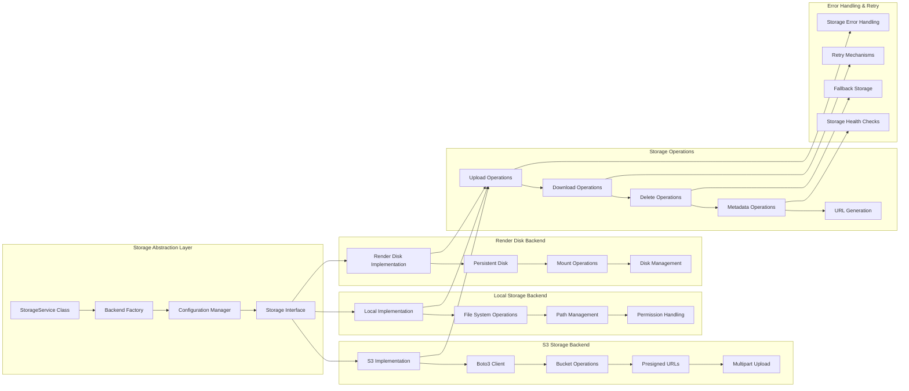

## API Integration Patterns

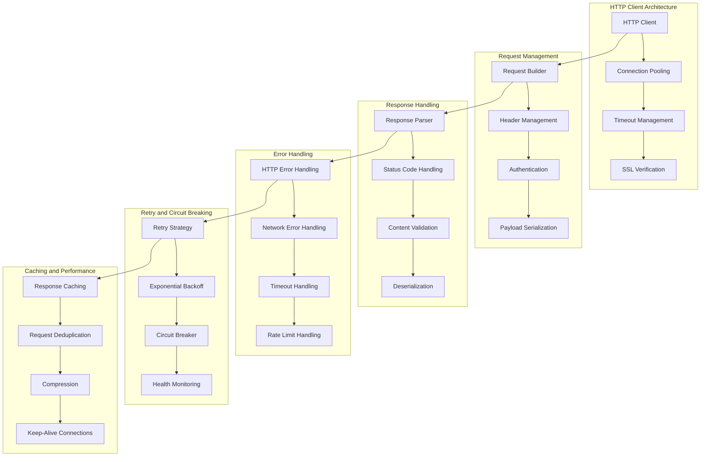

## Authentication and Authorization Integration

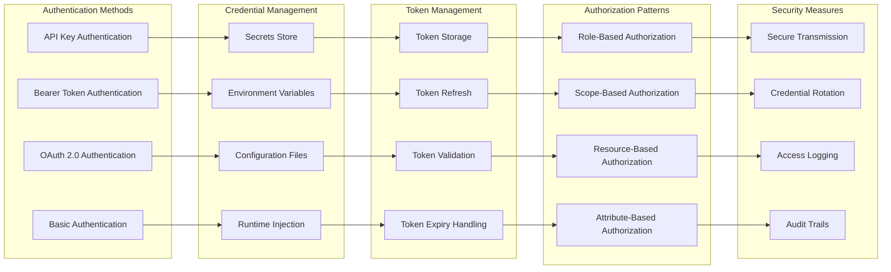

## Data Exchange and Serialization

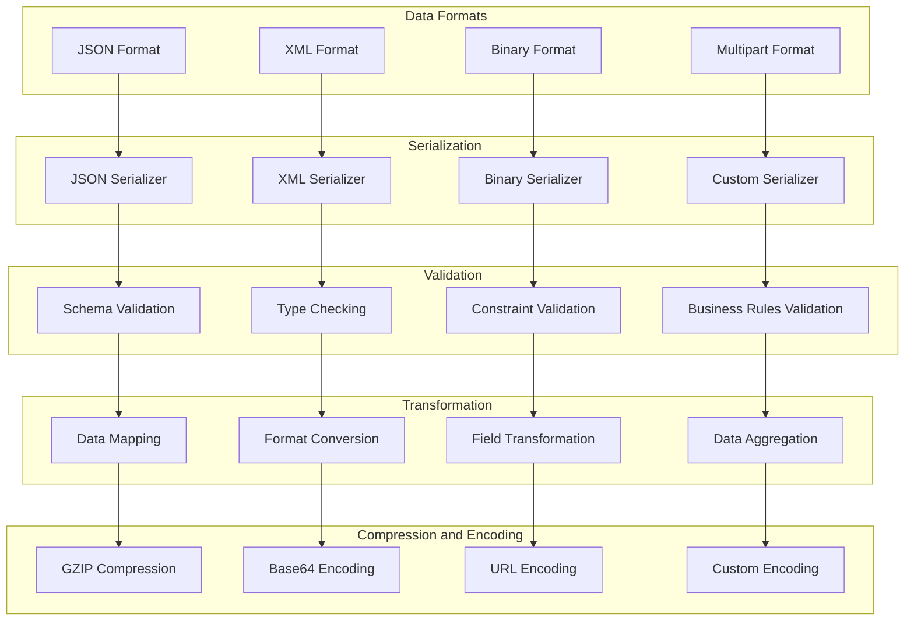

## External Service Monitoring

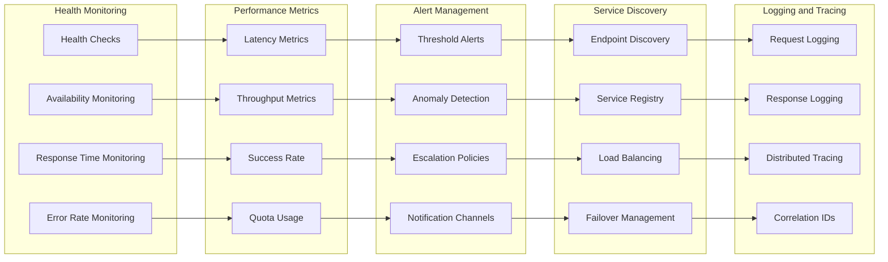

## Configuration and Environment Management

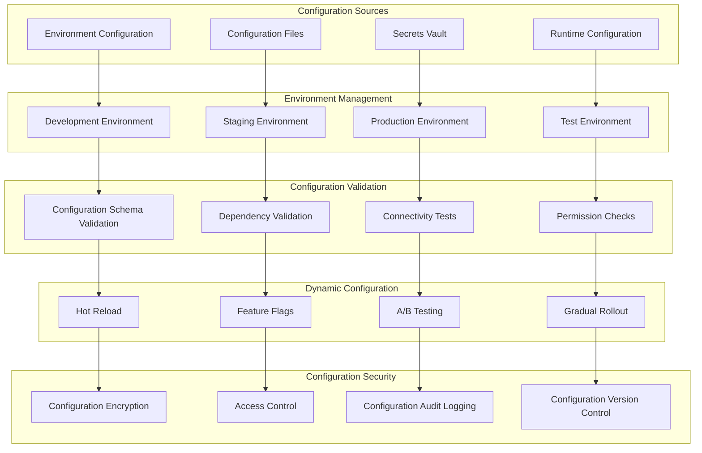

## Integration Testing and Quality Assurance

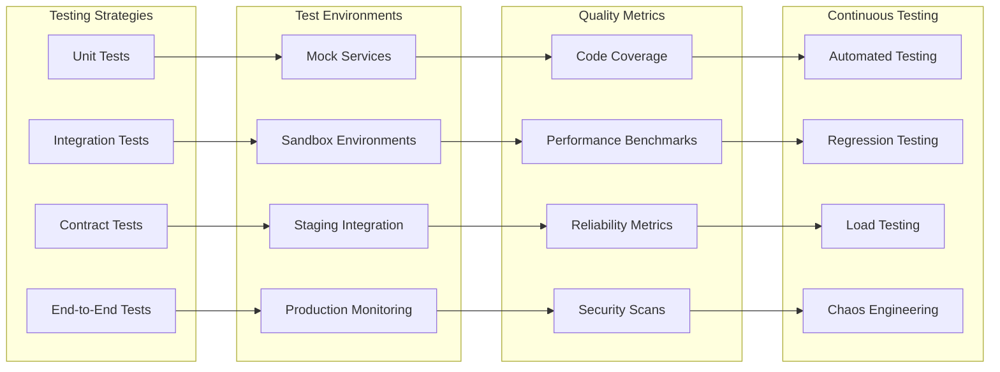

## API Versioning and Compatibility

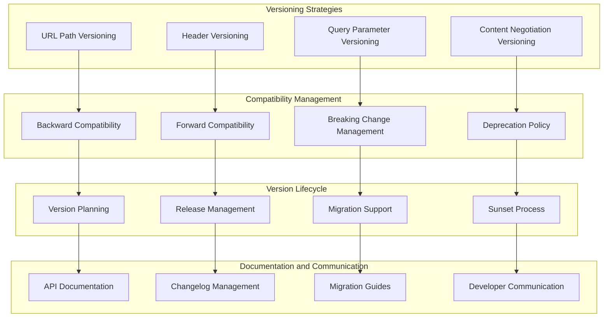

## Integration Security

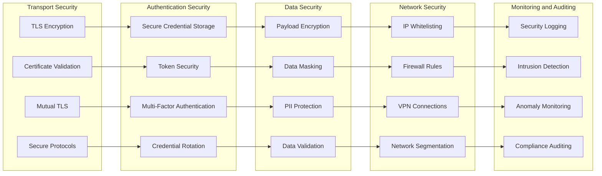

## Key Integration Principles

### **Service Abstraction**

- Abstract external service dependencies behind interfaces
- Implement adapter patterns for different service providers
- Enable easy switching between service providers
- Maintain consistent internal APIs regardless of external changes

### **Resilience and Fault Tolerance**

- Implement circuit breaker patterns for external service calls
- Use exponential backoff and retry mechanisms
- Provide graceful degradation when services are unavailable
- Maintain fallback mechanisms and default responses

### **Security and Compliance**

- Secure all external communications with TLS encryption
- Implement proper authentication and authorization
- Protect sensitive data in transit and at rest
- Maintain audit trails for all external service interactions

### **Performance and Scalability**

- Implement connection pooling and keep-alive connections
- Use caching strategies to reduce external service calls
- Implement request deduplication and batching where possible
- Monitor and optimize external service performance

### **Monitoring and Observability**

- Comprehensive logging of all external service interactions
- Real-time monitoring of service health and performance
- Alerting on service failures and performance degradation
- Distributed tracing for complex integration workflows

### **Configuration Management**

- Environment-specific configuration for different service endpoints
- Secure management of API keys and credentials
- Dynamic configuration updates without service restarts
- Version control and audit trails for configuration changes

This integration architecture ensures robust, secure, and scalable connections to external services while maintaining system reliability and performance. The architecture supports multiple service providers, implements comprehensive error handling, and provides excellent monitoring and observability capabilities.
