# Security Architecture

## Document Catalog - Security and Data Protection

This document details the security architecture, focusing on authentication, authorization, data protection, threat mitigation, and compliance measures for the Document Catalog application.

## Security Overview

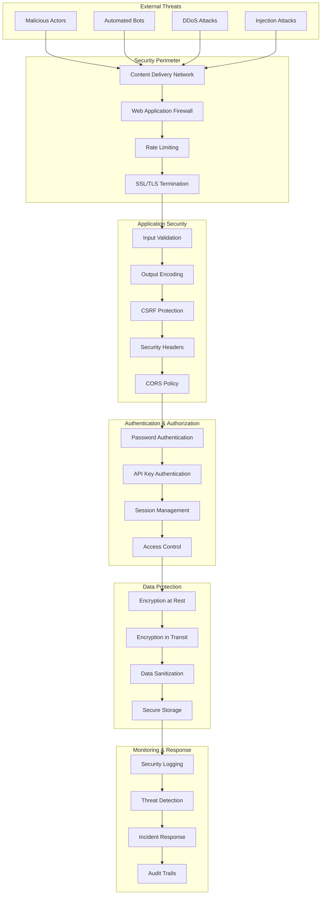

## Authentication Architecture

```mermaid
graph TD
    subgraph "Authentication Methods"
        UPLOAD_PASSWORD[Upload Password Authentication]
        API_KEY[API Key Authentication]
        SESSION_AUTH[Redis Session Authentication]
        OPTIONAL_AUTH[Optional Authentication]
    end

    subgraph "Upload Authentication Flow"
        UPLOAD_REQUEST[Upload Request]
        PASSWORD_CHECK[Password Validation]
        SIMPLE_AUTH[Simple Password Check]
        UPLOAD_GRANTED[Upload Access Granted]
        UPLOAD_DENIED[Upload Access Denied]
    end

    subgraph "API Authentication Flow"
        API_REQUEST[API Request]
        HEADER_CHECK[Authorization Header Check]
        API_KEY_VALIDATION[API Key Validation]
        API_ACCESS_GRANTED[API Access Granted]
        API_ACCESS_DENIED[API Access Denied]
    end

    subgraph "Session Authentication Flow"
        SESSION_REQUEST[Web Request]
        COOKIE_CHECK[Session Cookie Check]
        SESSION_VALIDATION[Redis Session Validation]
        SESSION_LOAD[Load Session Data]
        SESSION_GRANTED[Session Access Granted]
        SESSION_DENIED[Create New Session]
    end

    subgraph "Public Access Flow"
        PUBLIC_REQUEST[Public Request]
        ENDPOINT_CHECK[Endpoint Access Check]
        PUBLIC_ENDPOINTS[Public Endpoints]
        PROTECTED_ENDPOINTS[Protected Endpoints]
        PUBLIC_ACCESS[Public Access Granted]
        AUTH_REQUIRED[Authentication Required]
    end

    subgraph "Security Configuration"
        REQUIRE_AUTH_FLAG[require_auth Configuration]
        UPLOAD_PASSWORD_CONFIG[upload_password Configuration]
        API_KEY_CONFIG[api_key Configuration]
        SESSION_SECRET_CONFIG[session_secret_key Configuration]
        SECURITY_SETTINGS[Security Settings]
    end

    UPLOAD_REQUEST --> PASSWORD_CHECK
    PASSWORD_CHECK --> SIMPLE_AUTH
    SIMPLE_AUTH --> UPLOAD_GRANTED
    SIMPLE_AUTH --> UPLOAD_DENIED

    API_REQUEST --> HEADER_CHECK
    HEADER_CHECK --> API_KEY_VALIDATION
    API_KEY_VALIDATION --> API_ACCESS_GRANTED
    API_KEY_VALIDATION --> API_ACCESS_DENIED

    SESSION_REQUEST --> COOKIE_CHECK
    COOKIE_CHECK --> SESSION_VALIDATION
    SESSION_VALIDATION --> SESSION_LOAD
    SESSION_LOAD --> SESSION_GRANTED
    SESSION_VALIDATION --> SESSION_DENIED

    PUBLIC_REQUEST --> ENDPOINT_CHECK
    ENDPOINT_CHECK --> PUBLIC_ENDPOINTS
    ENDPOINT_CHECK --> PROTECTED_ENDPOINTS
    PUBLIC_ENDPOINTS --> PUBLIC_ACCESS
    PROTECTED_ENDPOINTS --> AUTH_REQUIRED

    REQUIRE_AUTH_FLAG --> SECURITY_SETTINGS
    UPLOAD_PASSWORD_CONFIG --> SECURITY_SETTINGS
    API_KEY_CONFIG --> SECURITY_SETTINGS
    SESSION_SECRET_CONFIG --> SECURITY_SETTINGS
    SECURITY_SETTINGS --> PASSWORD_CHECK
    SECURITY_SETTINGS --> API_KEY_VALIDATION
    SECURITY_SETTINGS --> SESSION_VALIDATION
    SECURITY_SETTINGS --> ENDPOINT_CHECK
```

## Redis Session Management Architecture

```mermaid
graph TB
    subgraph "Session Creation"
        USER_VISIT[User Visits Application]
        CHECK_COOKIE[Check for Session Cookie]
        EXISTING_SESSION[Existing Session Found]
        NEW_SESSION[Create New Session]
        GENERATE_ID[Generate Secure Session ID]
        ENCRYPT_DATA[Encrypt Session Data]
        STORE_REDIS[Store in Redis with TTL]
        SET_COOKIE[Set HttpOnly Session Cookie]
    end

    subgraph "Session Validation"
        INCOMING_REQUEST[Incoming Request]
        EXTRACT_COOKIE[Extract Session Cookie]
        LOAD_SESSION[Load Session from Redis]
        DECRYPT_SESSION[Decrypt Session Data]
        VALIDATE_TTL[Validate TTL]
        UPDATE_TIMESTAMP[Update Last Accessed]
        SESSION_VALID[Session Valid]
        SESSION_EXPIRED[Session Expired/Invalid]
    end

    subgraph "Session Security"
        FERNET_ENCRYPTION[Fernet Symmetric Encryption]
        KEY_DERIVATION[SHA-256 Key Derivation]
        SECURE_ID_GEN[Cryptographically Secure ID]
        HTTPONLY_COOKIE[HttpOnly Cookie Flag]
        SAMESITE_POLICY[SameSite Cookie Policy]
        SECURE_FLAG[Secure Flag for HTTPS]
    end

    subgraph "Session Storage"
        REDIS_STORAGE[Redis Storage]
        SESSION_PREFIX[session: Key Prefix]
        TTL_EXPIRATION[Automatic TTL Expiration]
        ENCRYPTED_PAYLOAD[Encrypted Data Payload]
        SESSION_METADATA[Session Metadata]
    end

    subgraph "Session Lifecycle"
        SESSION_CREATE[Create Session]
        SESSION_ACCESS[Access Session]
        SESSION_UPDATE[Update Session Data]
        SESSION_EXTEND[Extend Session TTL]
        SESSION_DELETE[Delete Session]
        SESSION_EXPIRE[Automatic Expiration]
    end

    USER_VISIT --> CHECK_COOKIE
    CHECK_COOKIE --> EXISTING_SESSION
    CHECK_COOKIE --> NEW_SESSION
    NEW_SESSION --> GENERATE_ID
    GENERATE_ID --> ENCRYPT_DATA
    ENCRYPT_DATA --> STORE_REDIS
    STORE_REDIS --> SET_COOKIE

    INCOMING_REQUEST --> EXTRACT_COOKIE
    EXTRACT_COOKIE --> LOAD_SESSION
    LOAD_SESSION --> DECRYPT_SESSION
    DECRYPT_SESSION --> VALIDATE_TTL
    VALIDATE_TTL --> UPDATE_TIMESTAMP
    UPDATE_TIMESTAMP --> SESSION_VALID
    VALIDATE_TTL --> SESSION_EXPIRED

    ENCRYPT_DATA --> FERNET_ENCRYPTION
    GENERATE_ID --> SECURE_ID_GEN
    FERNET_ENCRYPTION --> KEY_DERIVATION
    SET_COOKIE --> HTTPONLY_COOKIE
    SET_COOKIE --> SAMESITE_POLICY
    SET_COOKIE --> SECURE_FLAG

    STORE_REDIS --> REDIS_STORAGE
    REDIS_STORAGE --> SESSION_PREFIX
    REDIS_STORAGE --> TTL_EXPIRATION
    ENCRYPTED_PAYLOAD --> REDIS_STORAGE
    SESSION_METADATA --> REDIS_STORAGE

    SESSION_CREATE --> SESSION_ACCESS
    SESSION_ACCESS --> SESSION_UPDATE
    SESSION_UPDATE --> SESSION_EXTEND
    SESSION_EXTEND --> SESSION_DELETE
    SESSION_DELETE --> SESSION_EXPIRE
```

### **Redis Session Security Features**

#### **Encryption at Rest**
- **Algorithm**: Fernet symmetric encryption (AES-128 in CBC mode)
- **Key Management**: Encryption key derived from `session_secret_key` using SHA-256
- **Data Protection**: All session data encrypted before storage in Redis
- **Key Rotation**: Support for encryption key rotation without session loss

#### **Secure Session IDs**
- **Generation**: `secrets.token_urlsafe(32)` for cryptographically secure IDs
- **Length**: 43 characters (256 bits of entropy)
- **Uniqueness**: Statistically impossible collisions
- **Unpredictability**: No sequential or predictable patterns

#### **Cookie Security**
- **HttpOnly**: Prevents JavaScript access to session cookies
- **SameSite**: CSRF protection through SameSite policy (Lax/Strict)
- **Secure**: HTTPS-only transmission in production
- **Path**: Scoped to application path
- **Max-Age**: Configurable expiration (default: 14 days)

#### **Session Lifecycle Security**
- **TTL-Based Expiration**: Automatic cleanup of expired sessions
- **Idle Timeout**: Configurable session timeout (default: session_timeout_hours)
- **Activity Tracking**: Last accessed timestamp updated on each request
- **Explicit Deletion**: Support for explicit session termination
- **Session Extension**: Ability to extend session TTL on activity

#### **Data Integrity**
- **Modification Tracking**: Automatic detection of session data changes
- **Atomic Updates**: Redis operations ensure data consistency
- **Transaction Safety**: Session updates are atomic and isolated
- **Validation**: Session data validated on retrieval

#### **Fallback Mechanism**
- **Redis Unavailable**: Graceful degradation to in-memory sessions
- **Warning Headers**: Client notified when using fallback sessions
- **No Data Loss**: Existing Redis sessions preserved when service recovers
- **Health Monitoring**: Continuous Redis connection health checks

## Input Validation and Sanitization

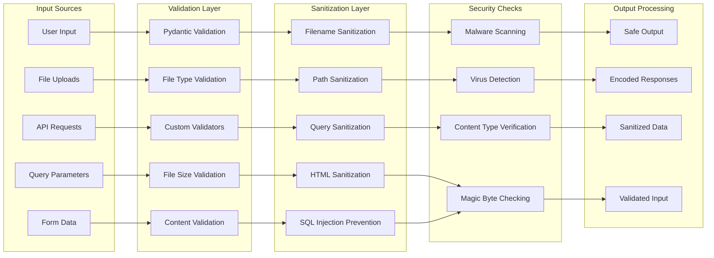

## Rate Limiting and DDoS Protection

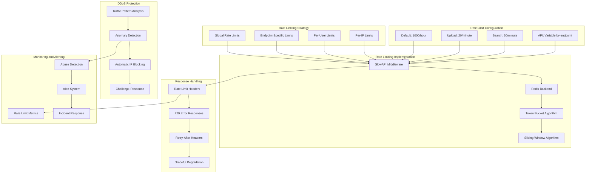

## Data Encryption and Protection

```mermaid
graph TB
    subgraph "Encryption at Rest"
        DATABASE_ENCRYPTION[Database Encryption]
        FILE_ENCRYPTION[File Storage Encryption]
        BACKUP_ENCRYPTION[Backup Encryption]
        CONFIG_ENCRYPTION[Configuration Encryption]
    end

    subgraph "Encryption in Transit"
        TLS_ENCRYPTION[TLS 1.3 Encryption]
        API_ENCRYPTION[API Communication Encryption]
        DATABASE_TLS[Database Connection TLS]
        EXTERNAL_API_TLS[External API TLS]
    end

    subgraph "Key Management"
        KEY_GENERATION[Key Generation]
        KEY_ROTATION[Key Rotation]
        KEY_STORAGE[Secure Key Storage]
        KEY_DISTRIBUTION[Key Distribution]
    end

    subgraph "Data Classification"
        PUBLIC_DATA[Public Data]
        INTERNAL_DATA[Internal Data]
        CONFIDENTIAL_DATA[Confidential Data]
        RESTRICTED_DATA[Restricted Data]
    end

    subgraph "Access Control"
        ROLE_BASED_ACCESS[Role-Based Access]
        ATTRIBUTE_BASED_ACCESS[Attribute-Based Access]
        LEAST_PRIVILEGE[Least Privilege Principle]
        SEGREGATION_OF_DUTIES[Segregation of Duties]
    end

    subgraph "Data Loss Prevention"
        DATA_MASKING[Data Masking]
        DATA_ANONYMIZATION[Data Anonymization]
        SECURE_DELETION[Secure Data Deletion]
        DATA_RETENTION[Data Retention Policies]
    end

    DATABASE_ENCRYPTION --> KEY_GENERATION
    FILE_ENCRYPTION --> KEY_GENERATION
    BACKUP_ENCRYPTION --> KEY_GENERATION
    CONFIG_ENCRYPTION --> KEY_GENERATION

    TLS_ENCRYPTION --> KEY_ROTATION
    API_ENCRYPTION --> KEY_ROTATION
    DATABASE_TLS --> KEY_ROTATION
    EXTERNAL_API_TLS --> KEY_ROTATION

    KEY_GENERATION --> KEY_STORAGE
    KEY_ROTATION --> KEY_STORAGE
    KEY_STORAGE --> KEY_DISTRIBUTION

    PUBLIC_DATA --> ROLE_BASED_ACCESS
    INTERNAL_DATA --> ROLE_BASED_ACCESS
    CONFIDENTIAL_DATA --> ATTRIBUTE_BASED_ACCESS
    RESTRICTED_DATA --> ATTRIBUTE_BASED_ACCESS

    ROLE_BASED_ACCESS --> LEAST_PRIVILEGE
    ATTRIBUTE_BASED_ACCESS --> LEAST_PRIVILEGE
    LEAST_PRIVILEGE --> SEGREGATION_OF_DUTIES

    DATA_MASKING --> DATA_ANONYMIZATION
    DATA_ANONYMIZATION --> SECURE_DELETION
    SECURE_DELETION --> DATA_RETENTION
```

## Security Headers and CORS

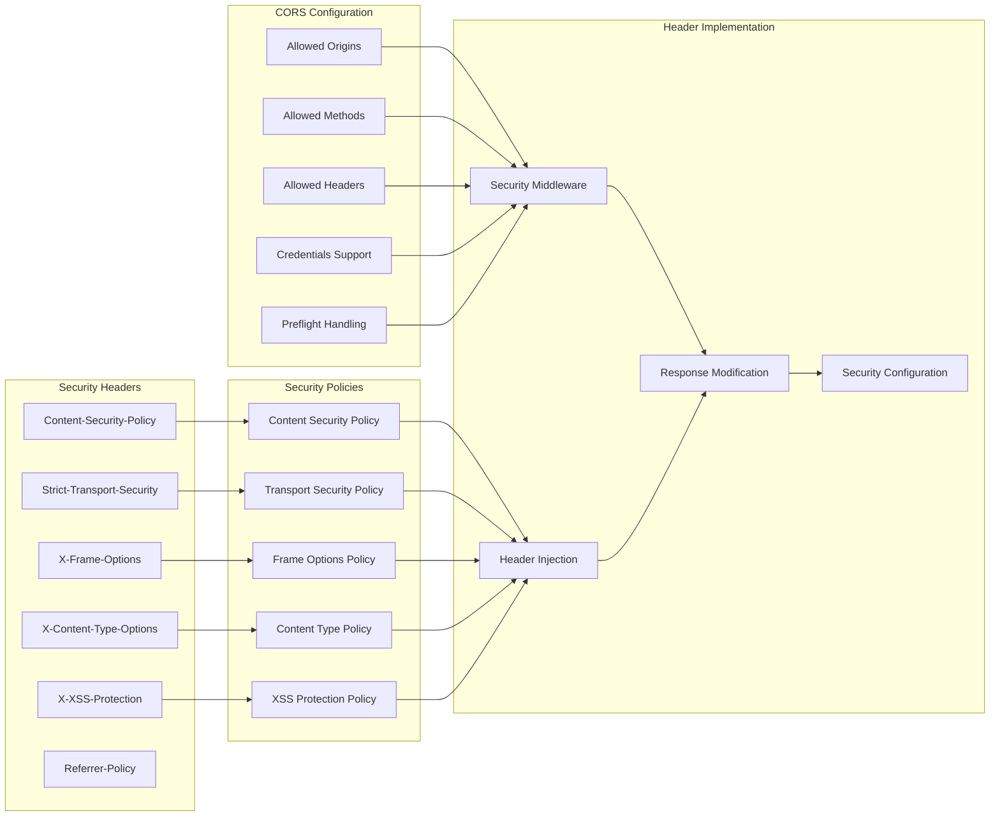

## File Security and Validation

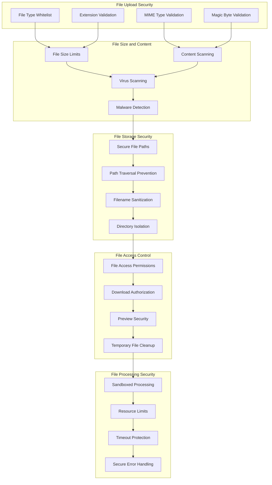

## Database Security

```mermaid
graph TB
    subgraph "Connection Security"
        TLS_CONNECTIONS[TLS Database Connections]
        CONNECTION_POOLING[Secure Connection Pooling]
        CREDENTIAL_MANAGEMENT[Database Credential Management]
        CONNECTION_LIMITS[Connection Limits]
    end

    subgraph "Query Security"
        PARAMETERIZED_QUERIES[Parameterized Queries]
        ORM_PROTECTION[ORM SQL Injection Protection]
        QUERY_VALIDATION[Query Validation]
        STORED_PROCEDURES[Stored Procedures]
    end

    subgraph "Access Control"
        DATABASE_USERS[Database User Management]
        ROLE_PERMISSIONS[Role-Based Permissions]
        SCHEMA_ISOLATION[Schema Isolation]
        PRIVILEGE_ESCALATION[Privilege Escalation Prevention]
    end

    subgraph "Data Protection"
        COLUMN_ENCRYPTION[Column-Level Encryption]
        ROW_LEVEL_SECURITY[Row-Level Security]
        DATA_MASKING[Dynamic Data Masking]
        AUDIT_LOGGING[Database Audit Logging]
    end

    subgraph "Backup Security"
        ENCRYPTED_BACKUPS[Encrypted Backups]
        BACKUP_ACCESS_CONTROL[Backup Access Control]
        POINT_IN_TIME_RECOVERY[Secure Point-in-Time Recovery]
        BACKUP_VALIDATION[Backup Integrity Validation]
    end

    TLS_CONNECTIONS --> CONNECTION_POOLING
    CONNECTION_POOLING --> CREDENTIAL_MANAGEMENT
    CREDENTIAL_MANAGEMENT --> CONNECTION_LIMITS

    PARAMETERIZED_QUERIES --> ORM_PROTECTION
    ORM_PROTECTION --> QUERY_VALIDATION
    QUERY_VALIDATION --> STORED_PROCEDURES

    DATABASE_USERS --> ROLE_PERMISSIONS
    ROLE_PERMISSIONS --> SCHEMA_ISOLATION
    SCHEMA_ISOLATION --> PRIVILEGE_ESCALATION

    COLUMN_ENCRYPTION --> ROW_LEVEL_SECURITY
    ROW_LEVEL_SECURITY --> DATA_MASKING
    DATA_MASKING --> AUDIT_LOGGING

    ENCRYPTED_BACKUPS --> BACKUP_ACCESS_CONTROL
    BACKUP_ACCESS_CONTROL --> POINT_IN_TIME_RECOVERY
    POINT_IN_TIME_RECOVERY --> BACKUP_VALIDATION
```

## Security Monitoring and Incident Response

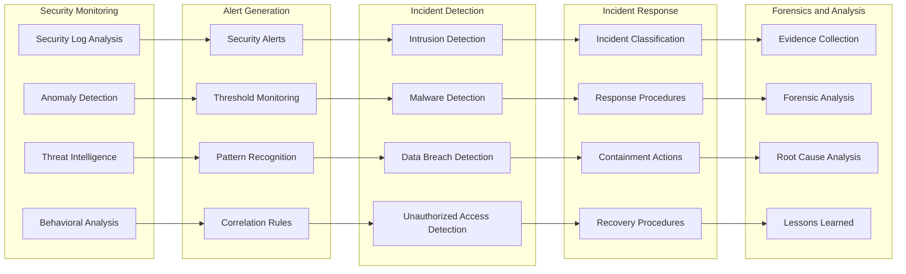

## Compliance and Audit

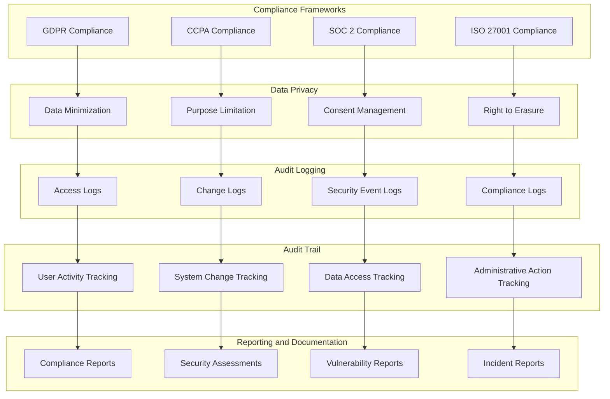

## Security Configuration Management

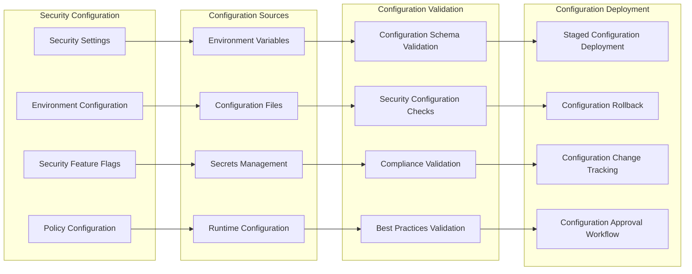

## Threat Model and Risk Assessment

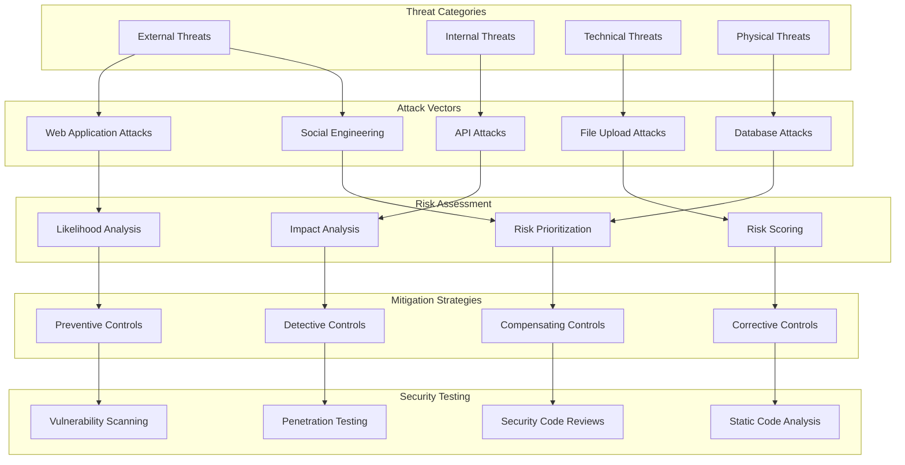

## Key Security Principles

### **Defense in Depth**

- Multiple layers of security controls
- Redundant security mechanisms
- Fail-safe defaults and secure by design
- Comprehensive threat coverage

### **Least Privilege Access**

- Minimal required permissions
- Role-based access control
- Regular access reviews and audits
- Principle of need-to-know

### **Zero Trust Architecture**

- Never trust, always verify
- Continuous authentication and authorization
- Micro-segmentation and isolation
- Comprehensive monitoring and logging

### **Security by Design**

- Security considerations from the start
- Secure coding practices
- Regular security assessments
- Continuous security improvement

### **Data Protection**

- Encryption at rest and in transit
- Data classification and handling
- Privacy by design principles
- Secure data lifecycle management

### **Incident Response Readiness**

- Prepared incident response procedures
- Regular security drills and testing
- Continuous monitoring and alerting
- Rapid containment and recovery capabilities

This security architecture provides comprehensive protection for the Document Catalog application, ensuring data confidentiality, integrity, and availability while maintaining compliance with security standards and regulations.
