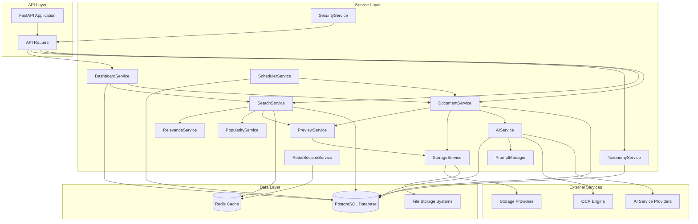
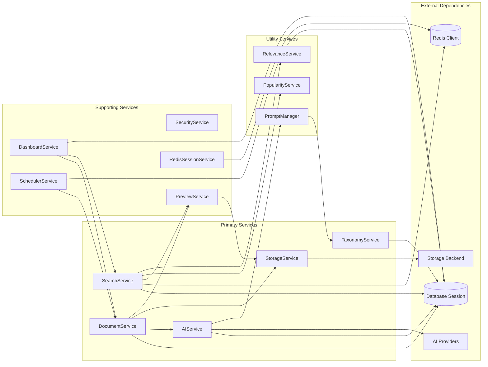
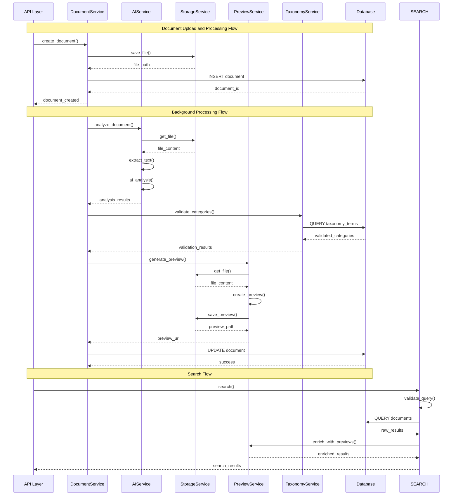
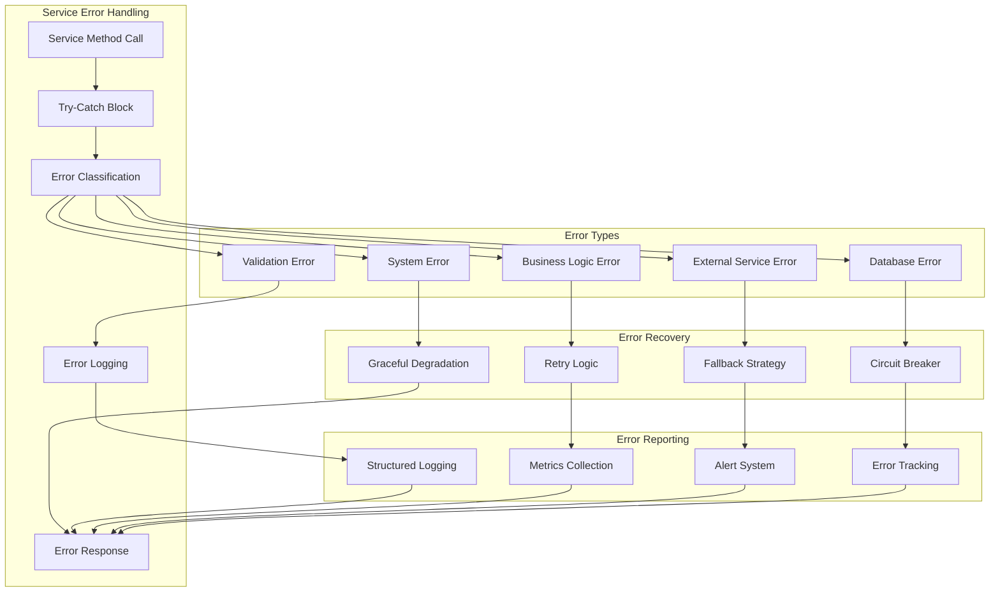
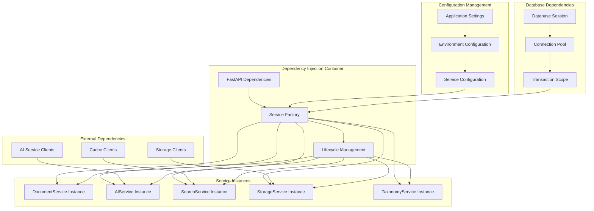

# Service Architecture

## Document Catalog - Business Logic and Service Layer

This document details the service architecture, focusing on business logic services, their relationships, dependency patterns, and communication flows within the Document Catalog application.

## Service Layer Overview



## Core Service Dependencies



## Document Service Architecture

```mermaid
graph TD
    subgraph "DocumentService"
        CREATE_DOC[create_document()]
        GET_DOC[get_document()]
        UPDATE_STATUS[update_document_status()]
        UPDATE_CONTENT[update_document_content()]
        DELETE_DOC[delete_document()]
        GET_STATS[get_statistics()]
        SEARCH_DOCS[search_documents_by_text()]
        UPDATE_EMBEDDINGS[update_document_embeddings()]
        UPDATE_PREVIEW[update_document_preview_url()]
        GET_DETAILS[get_document_details()]
    end

    subgraph "Database Operations"
        DOCUMENT_MODEL[Document Model]
        TAXONOMY_MAPPING[Document Taxonomy Mapping]
        QUERY_BUILDER[Query Builder]
        TRANSACTION_MANAGER[Transaction Manager]
    end

    subgraph "Business Logic"
        VALIDATION[Document Validation]
        STATUS_MANAGEMENT[Status Management]
        METADATA_PROCESSING[Metadata Processing]
        RELATIONSHIP_MANAGEMENT[Relationship Management]
    end

    CREATE_DOC --> VALIDATION
    CREATE_DOC --> DOCUMENT_MODEL
    GET_DOC --> QUERY_BUILDER
    UPDATE_STATUS --> STATUS_MANAGEMENT
    UPDATE_CONTENT --> METADATA_PROCESSING
    UPDATE_CONTENT --> TAXONOMY_MAPPING
    DELETE_DOC --> RELATIONSHIP_MANAGEMENT
    GET_STATS --> QUERY_BUILDER
    SEARCH_DOCS --> QUERY_BUILDER
    UPDATE_EMBEDDINGS --> DOCUMENT_MODEL
    UPDATE_PREVIEW --> DOCUMENT_MODEL
    GET_DETAILS --> QUERY_BUILDER
    GET_DETAILS --> RELATIONSHIP_MANAGEMENT

    VALIDATION --> TRANSACTION_MANAGER
    STATUS_MANAGEMENT --> TRANSACTION_MANAGER
    METADATA_PROCESSING --> TRANSACTION_MANAGER
    RELATIONSHIP_MANAGEMENT --> TRANSACTION_MANAGER
```

## AI Service Architecture

```mermaid
graph TD
    subgraph "AIService"
        ANALYZE_DOC[analyze_document()]
        EXTRACT_TEXT[_extract_text()]
        GENERATE_EMBEDDINGS[generate_embeddings()]
        ANALYZE_CHUNK[analyze_text_chunk()]
        GET_AI_INFO[get_ai_info()]
        GET_ANALYSIS_TYPES[get_available_analysis_types()]
    end

    subgraph "Analysis Types"
        UNIFIED[Unified Analysis]
        MODULAR[Modular Analysis]
        SPECIFIC[Specific Analysis]
    end

    subgraph "Text Extraction"
        PDF_EXTRACT[PDF Text Extraction]
        IMAGE_OCR[Image OCR]
        DOCUMENT_EXTRACT[Document Text Extraction]
        TEXT_PROCESSING[Text Processing]
    end

    subgraph "AI Provider Integration"
        ANTHROPIC_CLIENT[Anthropic Client]
        OPENAI_CLIENT[OpenAI Client]
        GEMINI_CLIENT[Gemini Client]
        PROVIDER_SELECTION[Provider Selection]
        FALLBACK_LOGIC[Fallback Logic]
    end

    subgraph "Prompt Management"
        PROMPT_MANAGER[PromptManager]
        TAXONOMY_PROMPTS[Taxonomy Prompts]
        ANALYSIS_PROMPTS[Analysis Prompts]
        EXTRACTION_PROMPTS[Extraction Prompts]
    end

    subgraph "Result Processing"
        JSON_EXTRACTION[JSON Extraction]
        KEYWORD_EXTRACTION[Keyword Extraction]
        MAPPING_EXTRACTION[Mapping Extraction]
        VALIDATION[Result Validation]
    end

    ANALYZE_DOC --> EXTRACT_TEXT
    ANALYZE_DOC --> UNIFIED
    ANALYZE_DOC --> MODULAR
    ANALYZE_DOC --> SPECIFIC

    EXTRACT_TEXT --> PDF_EXTRACT
    EXTRACT_TEXT --> IMAGE_OCR
    EXTRACT_TEXT --> DOCUMENT_EXTRACT
    EXTRACT_TEXT --> TEXT_PROCESSING

    UNIFIED --> PROVIDER_SELECTION
    MODULAR --> PROVIDER_SELECTION
    SPECIFIC --> PROVIDER_SELECTION

    PROVIDER_SELECTION --> ANTHROPIC_CLIENT
    PROVIDER_SELECTION --> OPENAI_CLIENT
    PROVIDER_SELECTION --> GEMINI_CLIENT
    PROVIDER_SELECTION --> FALLBACK_LOGIC

    ANTHROPIC_CLIENT --> PROMPT_MANAGER
    OPENAI_CLIENT --> PROMPT_MANAGER
    GEMINI_CLIENT --> PROMPT_MANAGER

    PROMPT_MANAGER --> TAXONOMY_PROMPTS
    PROMPT_MANAGER --> ANALYSIS_PROMPTS
    PROMPT_MANAGER --> EXTRACTION_PROMPTS

    ANTHROPIC_CLIENT --> JSON_EXTRACTION
    OPENAI_CLIENT --> JSON_EXTRACTION
    GEMINI_CLIENT --> JSON_EXTRACTION

    JSON_EXTRACTION --> KEYWORD_EXTRACTION
    JSON_EXTRACTION --> MAPPING_EXTRACTION
    JSON_EXTRACTION --> VALIDATION

    GENERATE_EMBEDDINGS --> PROVIDER_SELECTION
    ANALYZE_CHUNK --> PROVIDER_SELECTION
```

## Search Service Architecture

```mermaid
graph TD
    subgraph "SearchService"
        SEARCH[search()]
        SEARCH_CANONICAL[search_by_canonical_term()]
        SEARCH_VERBATIM[search_by_verbatim_term()]
        GET_MAPPING_STATS[get_mapping_statistics()]
        LOG_QUERY[log_search_query()]
        GET_TOP_QUERIES[get_top_queries()]
        GENERATE_FACETS[_generate_enhanced_facets()]
    end

    subgraph "Search Strategies"
        FULL_TEXT_SEARCH[Full-Text Search]
        VECTOR_SEARCH[Vector Similarity Search]
        TAXONOMY_SEARCH[Taxonomy-Based Search]
        HYBRID_SEARCH[Hybrid Search]
    end

    subgraph "Query Processing"
        QUERY_PARSER[Query Parser]
        FILTER_PROCESSOR[Filter Processor]
        SANITIZATION[Input Sanitization]
        VALIDATION[Query Validation]
    end

    subgraph "Database Queries"
        TSVECTOR_QUERY[TSVector Query Builder]
        PGVECTOR_QUERY[pgvector Query Builder]
        TAXONOMY_QUERY[Taxonomy Query Builder]
        COMPOSITE_QUERY[Composite Query Builder]
    end

    subgraph "Result Processing"
        RELEVANCE_SCORING[Relevance Scoring]
        RESULT_RANKING[Result Ranking]
        PAGINATION[Pagination Logic]
        FACET_GENERATION[Facet Generation]
        PREVIEW_ENRICHMENT[Preview Enrichment]
    end

    subgraph "Caching Layer"
        CACHE_CHECK[Cache Check]
        CACHE_STORE[Cache Store]
        CACHE_INVALIDATION[Cache Invalidation]
        TTL_MANAGEMENT[TTL Management]
    end

    subgraph "Analytics"
        QUERY_LOGGING[Query Logging]
        POPULARITY_TRACKING[Popularity Tracking]
        METRICS_COLLECTION[Metrics Collection]
        SEARCH_ANALYTICS[Search Analytics]
    end

    SEARCH --> QUERY_PARSER
    SEARCH --> CACHE_CHECK
    SEARCH_CANONICAL --> TAXONOMY_QUERY
    SEARCH_VERBATIM --> TAXONOMY_QUERY

    QUERY_PARSER --> FILTER_PROCESSOR
    QUERY_PARSER --> SANITIZATION
    QUERY_PARSER --> VALIDATION

    FILTER_PROCESSOR --> FULL_TEXT_SEARCH
    FILTER_PROCESSOR --> VECTOR_SEARCH
    FILTER_PROCESSOR --> TAXONOMY_SEARCH
    FILTER_PROCESSOR --> HYBRID_SEARCH

    FULL_TEXT_SEARCH --> TSVECTOR_QUERY
    VECTOR_SEARCH --> PGVECTOR_QUERY
    TAXONOMY_SEARCH --> TAXONOMY_QUERY
    HYBRID_SEARCH --> COMPOSITE_QUERY

    TSVECTOR_QUERY --> RELEVANCE_SCORING
    PGVECTOR_QUERY --> RELEVANCE_SCORING
    TAXONOMY_QUERY --> RELEVANCE_SCORING
    COMPOSITE_QUERY --> RELEVANCE_SCORING

    RELEVANCE_SCORING --> RESULT_RANKING
    RESULT_RANKING --> PAGINATION
    PAGINATION --> FACET_GENERATION
    FACET_GENERATION --> PREVIEW_ENRICHMENT

    PREVIEW_ENRICHMENT --> CACHE_STORE
    CACHE_CHECK --> PREVIEW_ENRICHMENT

    LOG_QUERY --> QUERY_LOGGING
    QUERY_LOGGING --> POPULARITY_TRACKING
    POPULARITY_TRACKING --> METRICS_COLLECTION
    METRICS_COLLECTION --> SEARCH_ANALYTICS
```

## Storage Service Architecture

```mermaid
graph TD
    subgraph "StorageService"
        SAVE_FILE[save_file()]
        GET_FILE[get_file()]
        DELETE_FILE[delete_file()]
        GET_FILE_URL[get_file_url()]
        CHECK_EXISTS[check_file_exists()]
        GET_SIZE[get_file_size()]
        GET_STORAGE_INFO[get_storage_info()]
    end

    subgraph "Storage Backends"
        LOCAL_STORAGE[Local Storage Backend]
        S3_STORAGE[S3 Storage Backend]
        RENDER_DISK[Render Disk Backend]
    end

    subgraph "Local Storage Operations"
        LOCAL_SAVE[_save_file_local()]
        LOCAL_GET[_get_file_local()]
        LOCAL_DELETE[_delete_file_local()]
        LOCAL_URL[_get_local_file_url()]
    end

    subgraph "S3 Storage Operations"
        S3_SAVE[_save_file_s3()]
        S3_GET[_get_file_s3()]
        S3_DELETE[_delete_file_s3()]
        S3_PRESIGNED[_get_s3_presigned_url()]
    end

    subgraph "Configuration Management"
        STORAGE_CONFIG[Storage Configuration]
        BACKEND_SELECTION[Backend Selection]
        CREDENTIAL_MANAGEMENT[Credential Management]
        PATH_RESOLUTION[Path Resolution]
    end

    subgraph "File Operations"
        FILE_VALIDATION[File Validation]
        PATH_SANITIZATION[Path Sanitization]
        METADATA_EXTRACTION[Metadata Extraction]
        ERROR_HANDLING[Error Handling]
    end

    SAVE_FILE --> BACKEND_SELECTION
    GET_FILE --> BACKEND_SELECTION
    DELETE_FILE --> BACKEND_SELECTION
    GET_FILE_URL --> BACKEND_SELECTION

    BACKEND_SELECTION --> LOCAL_STORAGE
    BACKEND_SELECTION --> S3_STORAGE
    BACKEND_SELECTION --> RENDER_DISK

    LOCAL_STORAGE --> LOCAL_SAVE
    LOCAL_STORAGE --> LOCAL_GET
    LOCAL_STORAGE --> LOCAL_DELETE
    LOCAL_STORAGE --> LOCAL_URL

    S3_STORAGE --> S3_SAVE
    S3_STORAGE --> S3_GET
    S3_STORAGE --> S3_DELETE
    S3_STORAGE --> S3_PRESIGNED

    SAVE_FILE --> FILE_VALIDATION
    SAVE_FILE --> PATH_SANITIZATION
    GET_FILE --> PATH_RESOLUTION
    DELETE_FILE --> PATH_RESOLUTION

    FILE_VALIDATION --> METADATA_EXTRACTION
    PATH_SANITIZATION --> ERROR_HANDLING
    PATH_RESOLUTION --> ERROR_HANDLING
    METADATA_EXTRACTION --> ERROR_HANDLING

    STORAGE_CONFIG --> BACKEND_SELECTION
    CREDENTIAL_MANAGEMENT --> S3_STORAGE
```

## Taxonomy Service Architecture

```mermaid
graph TD
    subgraph "TaxonomyService"
        INIT_FROM_CSV[initialize_from_csv()]
        GET_HIERARCHY[get_taxonomy_hierarchy()]
        GET_CATEGORIES[get_primary_categories()]
        GET_SUBCATEGORIES[get_subcategories()]
        SEARCH_TERMS[search_terms()]
        FIND_CREATE_TERM[find_or_create_term()]
        GET_CANONICAL_TERMS[get_all_canonical_terms()]
        VALIDATE_MAPPING[validate_taxonomy_mapping()]
        GET_STATISTICS[get_statistics()]
    end

    subgraph "Data Models"
        TAXONOMY_TERMS[TaxonomyTerm Model]
        TAXONOMY_SYNONYMS[TaxonomySynonym Model]
        DOCUMENT_TAXONOMY_MAP[DocumentTaxonomyMap Model]
    end

    subgraph "Hierarchy Management"
        PARENT_CHILD[Parent-Child Relationships]
        CATEGORY_STRUCTURE[Category Structure]
        TERM_VALIDATION[Term Validation]
        SYNONYM_MANAGEMENT[Synonym Management]
    end

    subgraph "Search and Mapping"
        TERM_SEARCH[Term Search Logic]
        CANONICAL_MAPPING[Canonical Term Mapping]
        FUZZY_MATCHING[Fuzzy Matching]
        SIMILARITY_SCORING[Similarity Scoring]
    end

    subgraph "CSV Processing"
        CSV_PARSER[CSV Parser]
        HIERARCHY_BUILDER[Hierarchy Builder]
        TERM_CREATOR[Term Creator]
        SYNONYM_CREATOR[Synonym Creator]
    end

    subgraph "Database Operations"
        QUERY_BUILDER[Query Builder]
        BULK_OPERATIONS[Bulk Operations]
        TRANSACTION_MANAGEMENT[Transaction Management]
        CACHE_MANAGEMENT[Cache Management]
    end

    INIT_FROM_CSV --> CSV_PARSER
    CSV_PARSER --> HIERARCHY_BUILDER
    HIERARCHY_BUILDER --> TERM_CREATOR
    TERM_CREATOR --> SYNONYM_CREATOR

    GET_HIERARCHY --> PARENT_CHILD
    GET_CATEGORIES --> CATEGORY_STRUCTURE
    GET_SUBCATEGORIES --> CATEGORY_STRUCTURE
    SEARCH_TERMS --> TERM_SEARCH
    FIND_CREATE_TERM --> CANONICAL_MAPPING
    GET_CANONICAL_TERMS --> CANONICAL_MAPPING
    VALIDATE_MAPPING --> FUZZY_MATCHING

    PARENT_CHILD --> TAXONOMY_TERMS
    CATEGORY_STRUCTURE --> TAXONOMY_TERMS
    TERM_VALIDATION --> TAXONOMY_TERMS
    SYNONYM_MANAGEMENT --> TAXONOMY_SYNONYMS

    TERM_SEARCH --> QUERY_BUILDER
    CANONICAL_MAPPING --> QUERY_BUILDER
    FUZZY_MATCHING --> SIMILARITY_SCORING
    SIMILARITY_SCORING --> QUERY_BUILDER

    TERM_CREATOR --> BULK_OPERATIONS
    SYNONYM_CREATOR --> BULK_OPERATIONS
    BULK_OPERATIONS --> TRANSACTION_MANAGEMENT
    TRANSACTION_MANAGEMENT --> CACHE_MANAGEMENT
```

## Service Communication Patterns



## Service Error Handling Patterns



## Service Configuration and Dependency Injection



## Redis Session Service Architecture

```mermaid
graph TD
    subgraph "RedisSessionService"
        CREATE_SESSION[create_session()]
        GET_SESSION[get_session()]
        UPDATE_SESSION[update_session()]
        DELETE_SESSION[delete_session()]
        EXTEND_SESSION[extend_session()]
        GET_TTL[get_session_ttl()]
        CLEANUP[cleanup_expired_sessions()]
        GET_STATS[get_session_stats()]
        HEALTH_CHECK[health_check()]
    end

    subgraph "Redis Operations"
        REDIS_CLIENT[Redis Client]
        KEY_MANAGEMENT[Session Key Management]
        TTL_MANAGEMENT[TTL Management]
        CONNECTION_POOL[Connection Pooling]
    end

    subgraph "Security Features"
        ENCRYPTION[Session Data Encryption]
        FERNET[Fernet Cryptography]
        KEY_DERIVATION[Key Derivation from Secret]
        SECURE_ID[Secure Session ID Generation]
    end

    subgraph "Session Storage"
        SESSION_PREFIX[session: Prefix]
        SESSION_DATA[Encrypted Session Data]
        SESSION_METADATA[Session Metadata]
        TTL_EXPIRY[Automatic TTL Expiry]
    end

    subgraph "Middleware Integration"
        REDIS_SESSION_MIDDLEWARE[RedisSessionMiddleware]
        COOKIE_MANAGEMENT[Cookie Management]
        SESSION_LOADING[Session Loading]
        SESSION_SAVING[Session Saving]
    end

    CREATE_SESSION --> ENCRYPTION
    GET_SESSION --> ENCRYPTION
    UPDATE_SESSION --> ENCRYPTION
    DELETE_SESSION --> REDIS_CLIENT
    EXTEND_SESSION --> TTL_MANAGEMENT

    ENCRYPTION --> FERNET
    FERNET --> KEY_DERIVATION
    SECURE_ID --> SESSION_PREFIX

    CREATE_SESSION --> REDIS_CLIENT
    GET_SESSION --> REDIS_CLIENT
    UPDATE_SESSION --> REDIS_CLIENT

    REDIS_CLIENT --> SESSION_DATA
    SESSION_DATA --> TTL_EXPIRY
    SESSION_PREFIX --> KEY_MANAGEMENT
    KEY_MANAGEMENT --> SESSION_METADATA

    REDIS_SESSION_MIDDLEWARE --> COOKIE_MANAGEMENT
    COOKIE_MANAGEMENT --> SESSION_LOADING
    SESSION_LOADING --> GET_SESSION
    SESSION_SAVING --> UPDATE_SESSION
    SESSION_SAVING --> CREATE_SESSION

    HEALTH_CHECK --> REDIS_CLIENT
    GET_STATS --> REDIS_CLIENT
    CLEANUP --> REDIS_CLIENT
```

### **Redis Session Service Features**

#### **Session Management**
- Secure session ID generation with `secrets.token_urlsafe(32)`
- Encrypted session data storage using Fernet cryptography
- Automatic TTL-based session expiration
- Session extension and refresh capabilities

#### **Security Implementation**
- **Encryption**: All session data encrypted at rest in Redis
- **Key Derivation**: Encryption key derived from session secret using SHA-256
- **Secure IDs**: Cryptographically secure session ID generation
- **HttpOnly Cookies**: Session cookies protected from JavaScript access

#### **Session Lifecycle**
1. **Creation**: Generate secure ID, encrypt data, store in Redis
2. **Access**: Retrieve, decrypt, update last accessed timestamp
3. **Update**: Re-encrypt modified data, preserve TTL
4. **Expiration**: Automatic Redis TTL-based cleanup
5. **Deletion**: Explicit session removal and cookie clearing

#### **Performance Features**
- Connection pooling for Redis operations
- Configurable session timeout (default: session_timeout_hours)
- Health checks and statistics monitoring
- Fallback session support when Redis unavailable

#### **Middleware Integration**
- **RedisSessionMiddleware**: ASGI middleware for automatic session handling
- **Cookie Management**: Secure cookie configuration (SameSite, HttpOnly, Secure)
- **Session Tracking**: Automatic modification tracking for efficient updates
- **Fallback Mode**: In-memory sessions when Redis unavailable

## Key Service Architecture Principles

### **Single Responsibility Principle**

- Each service has a clearly defined responsibility
- Services focus on specific business domains
- Clear separation of concerns between services
- Minimal overlap in functionality

### **Dependency Inversion**

- Services depend on abstractions, not concrete implementations
- Database sessions injected through FastAPI dependencies
- External service clients configurable and swappable
- Testable service interfaces

### **Loose Coupling**

- Services communicate through well-defined interfaces
- Minimal direct dependencies between services
- Event-driven communication where appropriate
- Independent service evolution

### **High Cohesion**

- Related functionality grouped within services
- Clear service boundaries and responsibilities
- Consistent internal service architecture
- Logical organization of service methods

### **Error Handling Strategy**

- Consistent error handling patterns across services
- Proper exception propagation and transformation
- Comprehensive error logging and monitoring
- Graceful degradation and fallback mechanisms

### **Performance Optimization**

- Efficient database query patterns
- Caching strategies at service level
- Asynchronous operations where beneficial
- Resource pooling and connection management

### **Testability**

- Services designed for unit testing
- Mock-friendly interfaces and dependencies
- Clear separation of business logic and infrastructure
- Comprehensive test coverage strategies

This service architecture provides a robust, scalable, and maintainable foundation for the Document Catalog application, ensuring clear separation of concerns, efficient resource utilization, and excellent developer experience.
