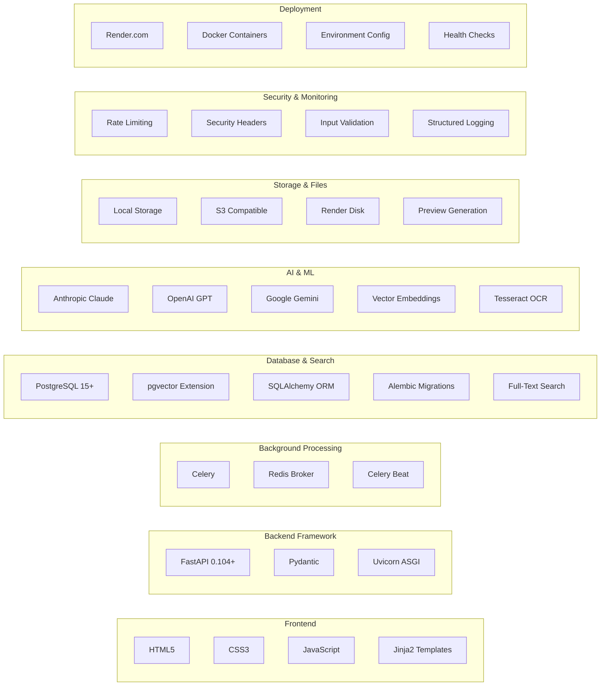
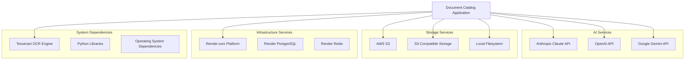

# System Architecture Overview

## Document Catalog - AI-Powered Document Processing System

This document provides a comprehensive overview of the system architecture for the Document Catalog application, an AI-powered document processing and search system built with FastAPI.

## High-Level System Architecture

```mermaid
graph TB
    subgraph "Client Layer"
        WEB[Web Browser]
        API_CLIENT[API Clients]
        MOBILE[Mobile Apps]
    end

    subgraph "Load Balancer & CDN"
        LB[Load Balancer]
        CDN[Content Delivery Network]
    end

    subgraph "Application Layer"
        FASTAPI[FastAPI Application]
        WORKER[Celery Workers]
        SCHEDULER[Celery Beat Scheduler]
    end

    subgraph "Service Layer"
        DOC_SVC[Document Service]
        AI_SVC[AI Service]
        SEARCH_SVC[Search Service]
        STORAGE_SVC[Storage Service]
        TAXONOMY_SVC[Taxonomy Service]
        SECURITY_SVC[Security Service]
        PREVIEW_SVC[Preview Service]
        DASHBOARD_SVC[Dashboard Service]
    end

    subgraph "Data Layer"
        POSTGRES[(PostgreSQL + pgvector)]
        REDIS[(Redis)]
        STORAGE[File Storage]
    end

    subgraph "External Services"
        ANTHROPIC[Anthropic Claude]
        OPENAI[OpenAI GPT]
        GEMINI[Google Gemini]
        S3[AWS S3 / Compatible]
        TESSERACT[Tesseract OCR]
    end

    subgraph "Infrastructure"
        RENDER[Render.com Platform]
        MONITORING[Monitoring & Logs]
        BACKUP[Backup Systems]
    end

    %% Client connections
    WEB --> LB
    API_CLIENT --> LB
    MOBILE --> LB

    %% Load balancer to application
    LB --> FASTAPI
    CDN --> STORAGE

    %% Application layer connections
    FASTAPI --> DOC_SVC
    FASTAPI --> SEARCH_SVC
    FASTAPI --> TAXONOMY_SVC
    FASTAPI --> DASHBOARD_SVC
    WORKER --> DOC_SVC
    WORKER --> AI_SVC
    SCHEDULER --> WORKER

    %% Service layer connections
    DOC_SVC --> POSTGRES
    SEARCH_SVC --> POSTGRES
    TAXONOMY_SVC --> POSTGRES
    DASHBOARD_SVC --> POSTGRES
    AI_SVC --> ANTHROPIC
    AI_SVC --> OPENAI
    AI_SVC --> GEMINI
    AI_SVC --> TESSERACT
    STORAGE_SVC --> S3
    STORAGE_SVC --> STORAGE
    PREVIEW_SVC --> STORAGE_SVC

    %% Data layer connections
    FASTAPI --> REDIS
    WORKER --> REDIS
    SCHEDULER --> REDIS

    %% Infrastructure
    RENDER -.-> FASTAPI
    RENDER -.-> WORKER
    RENDER -.-> POSTGRES
    RENDER -.-> REDIS
    MONITORING -.-> FASTAPI
    MONITORING -.-> WORKER
    BACKUP -.-> POSTGRES
    BACKUP -.-> STORAGE
```

## Technology Stack

## Core System Components

### 1. **FastAPI Application Server**

- **Purpose**: Main web application and API server
- **Technology**: FastAPI with Uvicorn ASGI server
- **Features**:
  - RESTful API endpoints
  - Web interface with Jinja2 templates
  - Rate limiting and security middleware
  - Health checks and monitoring
  - CORS support for cross-origin requests

### 2. **Celery Background Processing**

- **Purpose**: Asynchronous document processing and scheduled tasks
- **Components**:
  - **Celery Workers**: Process documents, generate previews, AI analysis
  - **Celery Beat**: Scheduled tasks for maintenance and cleanup
  - **Redis Broker**: Message queue and result backend
- **Features**:
  - Concurrent processing with configurable workers
  - Task retry mechanisms and error handling
  - Progress tracking and status updates

### 3. **PostgreSQL Database with pgvector**

- **Purpose**: Primary data storage with vector search capabilities
- **Features**:
  - Document metadata and content storage
  - Hierarchical taxonomy system
  - Full-text search with tsvector
  - Vector similarity search with pgvector
  - JSONB for flexible schema storage
  - Optimized indexes for performance

### 4. **Multi-Provider AI Integration**

- **Providers**: Anthropic Claude, OpenAI GPT, Google Gemini
- **Capabilities**:
  - Text extraction from documents and images
  - Content analysis and summarization
  - Keyword extraction and categorization
  - Vector embedding generation
  - OCR processing with Tesseract

### 5. **Flexible Storage System**

- **Options**: Local filesystem, S3-compatible storage, Render disk
- **Features**:
  - Abstracted storage interface
  - Preview and thumbnail generation
  - File validation and security
  - Configurable storage backends

## External Dependencies

## System Characteristics

### **Scalability**

- Horizontal scaling through multiple Celery workers
- Database connection pooling and query optimization
- Caching layer with Redis for frequently accessed data
- CDN integration for static assets and file serving

### **Reliability**

- Health check endpoints for monitoring
- Graceful error handling and recovery
- Database migrations with Alembic
- Backup and disaster recovery procedures

### **Security**

- Input validation and sanitization
- Rate limiting to prevent abuse
- Security headers and CORS configuration
- File type validation and content scanning
- Optional API key authentication

### **Performance**

- Asynchronous processing for I/O operations
- Database indexing for fast queries
- Vector search optimization with HNSW indexes
- Background processing to avoid blocking requests
- Caching strategies for search results

### **Maintainability**

- Clean architecture with separated concerns
- Comprehensive logging and monitoring
- Environment-based configuration
- Automated testing and deployment
- Documentation and API specifications

## Architecture Decisions

### **Why FastAPI?**

- High performance ASGI framework
- Automatic API documentation generation
- Built-in data validation with Pydantic
- Excellent async/await support
- Strong typing and IDE support

### **Why PostgreSQL + pgvector?**

- ACID compliance and reliability
- Advanced indexing capabilities
- Native JSON support with JSONB
- Vector similarity search with pgvector
- Full-text search capabilities

### **Why Celery?**

- Mature and reliable task queue
- Flexible routing and scaling options
- Built-in retry and error handling
- Monitoring and management tools
- Redis integration for persistence

### **Why Multi-Provider AI?**

- Redundancy and fallback options
- Cost optimization across providers
- Feature diversity and capabilities
- Vendor lock-in avoidance
- Performance optimization

## Next Steps

This system architecture overview provides the foundation for understanding the Document Catalog application. The following detailed architecture documents will dive deeper into specific aspects:

1. **Application Layer Architecture** - FastAPI structure and API design
2. **Data Flow Architecture** - Document processing and search workflows
3. **Service Architecture** - Business logic and service interactions
4. **Deployment Architecture** - Infrastructure and scaling patterns
5. **Security Architecture** - Authentication and data protection
6. **Integration Architecture** - External service integrations

Each document will provide detailed Mermaid diagrams and implementation guidance for the respective architectural domain.
